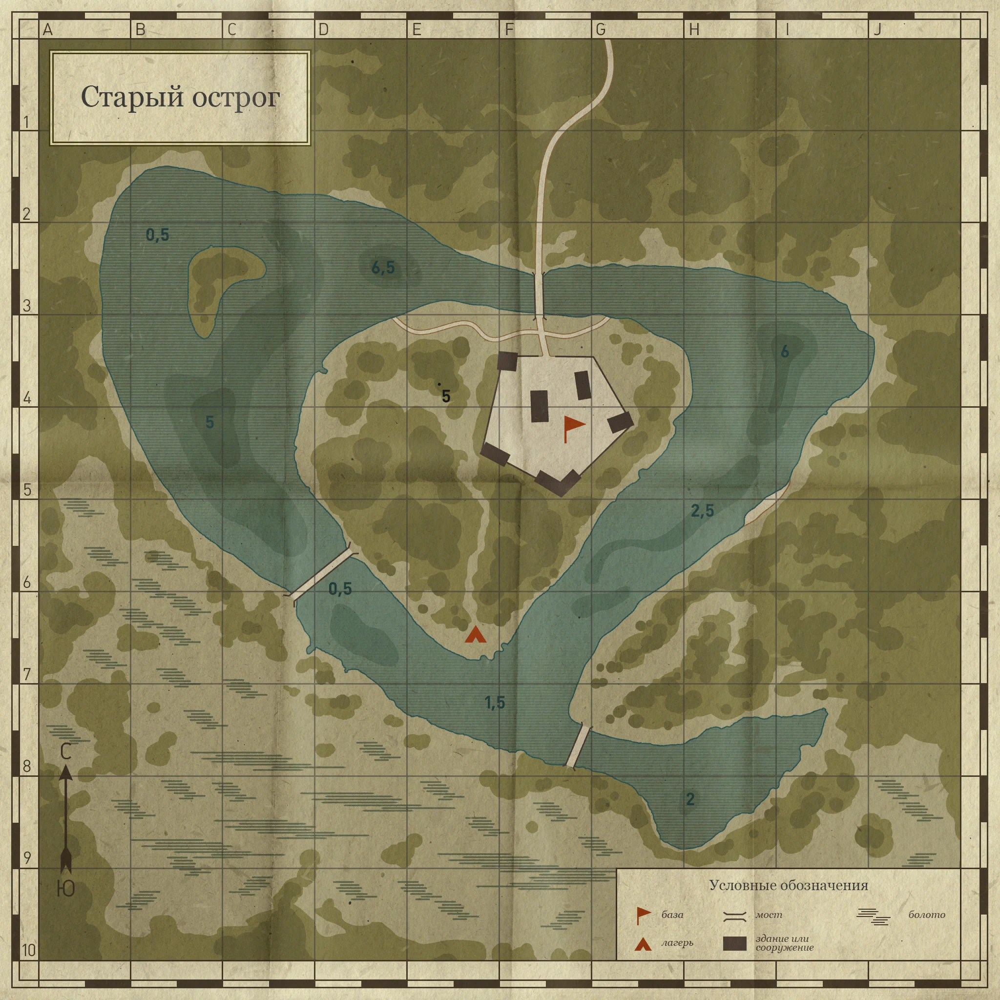
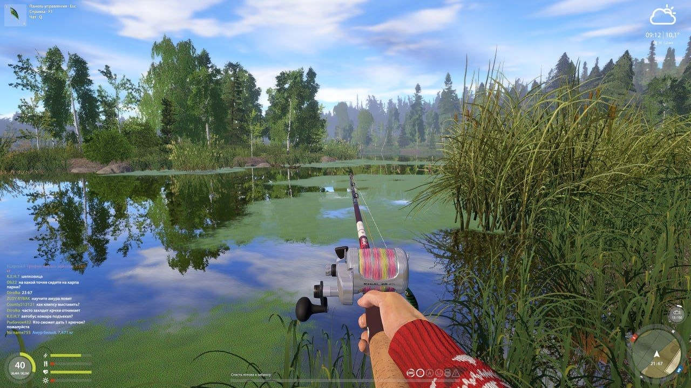
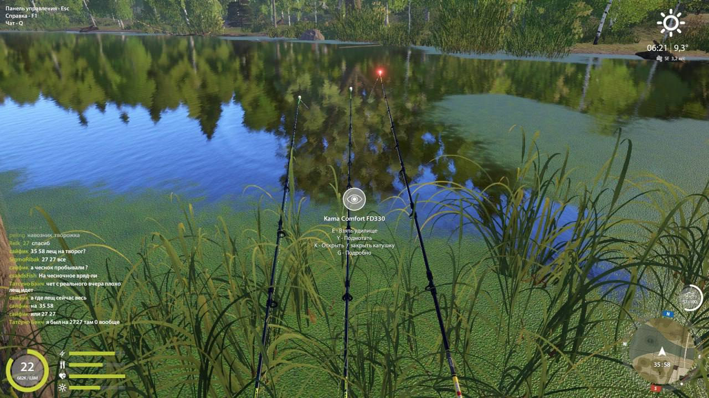
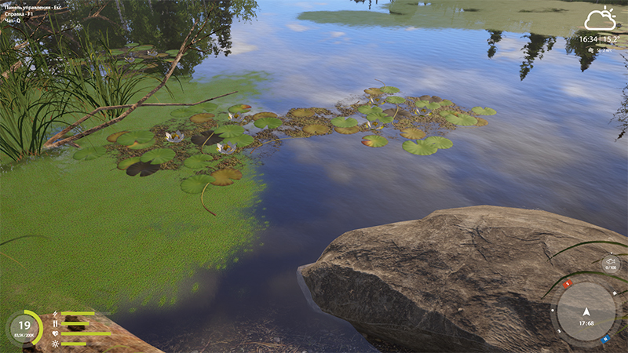
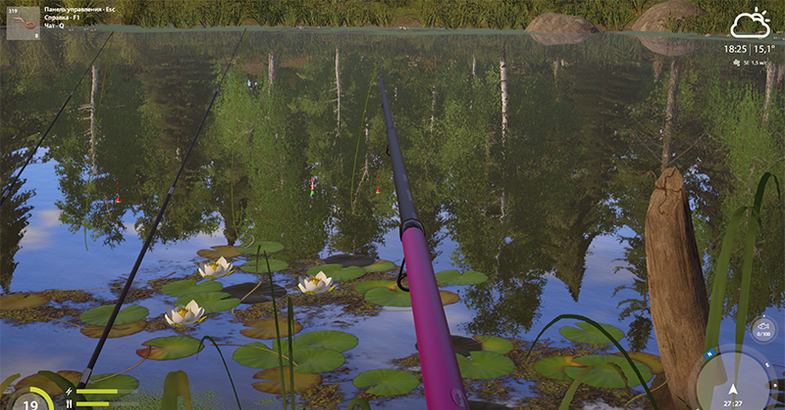

# RF4 Old Burg Lake：基于公开地图与截图的空间作者成本测算

文档状态：**HISTORICAL / 归档证据**  
权威级别：**外部资料复测；非 RF4 内部事实，也非 FCF contract**  
当前入口：[`RF4 / Fishing Planet 调研报告`](../../rf4_fishing_planet_bite_mechanism_research_report.md)；空间计数替代实验见 [`Ogre Lake reproducible overlay`](../../ogre_lake_reproducible_overlay_experiment.md)。

> **证据等级修正**：本文件中的 `13/31/42/.../116` 没有来自完整 RF4 Layer
> mask 的几何 overlay，属于情景参数，不是 RF4 Patch 测量值，也不能称为经验
> lower bound。严格计数方法见
> [Ogre Lake reproducible overlay experiment](../../ogre_lake_reproducible_overlay_experiment.md)。

## 0. 目的与证据边界

本文件用 Russian Fishing 4 的 Old Burg Lake（Старый Острог）公开地图和游戏
截图，对 Ogre Lake 的推导做一次更接近成品游戏画面的复测。它不是对 RF4
内部实现的逆向工程，也不声称 RF4 使用 Manual Region、Habitat Patch 或 FCF。

以下内容严格分成三类：

- **可见事实**：截图或公开地图能直接看到；
- **作者建模假设**：若 FCF Manual Patch 要表达该现象，可能需要的 Layer；
- **不可确认**：Temperature、DO、鱼分布算法、阴影实现及 RF4 内部数据结构。

## 1. 样本与来源

### 1.1 地图



地图直接可见：环绕中央岛屿的连通水体、多个狭窄通道、三座桥、建筑/结构、
沼泽地标，以及 `0.5m、1.5m、2m、2.5m、5m、6m、6.5m` 等深度标注。来源：
[RF4HUB Old Burg Lake map](https://en.rf4h.ru/map/prison/)。RF4HUB 将其描述为
一座位于沼泽林地、面积较小但有较深水区的湖泊。

### 1.2 游戏截图样本



截图可见近岸密集芦苇、大片浮萍/藻毯、开阔水面与对岸林线；页面将位置标为
Old Burg Lake `21:67`，并记录早晨雨天。来源：
[RF4 Posts spot 21:67](https://rf4-posts.com/en/spots/3ed9757e-382e-4809-b2f2-3b0cf5179d4c)。



截图可见草带、浮萍边缘、开水面与树木倒影；页面标注 Old Burg Lake `35:58`、
06:21，并附地图截图。来源：
[RF4 Posts spot 35:58](https://rf4-posts.com/en/spots/47364f7e-e2d3-4365-9dc2-83133825f06f)。



此 RF4 游戏截图直接显示睡莲斑块、浮萍边缘、裸水、岸边草与一块近岸岩石；
它用于补充“同一近岸 meaningful region 内存在多个细边界”的视觉样本。来源：
[Pikabu RF4 screenshot collection](https://pikabu.ru/story/russkaya_ryibalka_4_mmorpg_7028135)。



该 RF4 截图用于观察时段光照下的睡莲/水面关系，不据此断言具体水域或阴影
算法。来源同上。

## 2. 从图片能确认什么

### 2.1 Geometry 不是一个简单圆湖

中央大岛把水域变成环状；北侧和西南侧存在狭窄通道，桥又形成局部结构关系。
即便水体拓扑上连通，按岸形和通道意义至少可以命名北湾、西湾、东湾、南湾、
三处通道和若干桥邻域。

### 2.2 Depth 已经跨越多个水体分支

地图显示浅水 `0.5m`、南部 `1.5–2m`、东侧 `2.5–6m`、西北/北部 `5–6.5m`。
深度不是同心圆：中央岛、通道和弯曲岸线会把同一深度级分成不相邻部分。

### 2.3 Vegetation 具有多种边界

截图不是单一“有草/无草”。可区分：挺水芦苇、浮萍/藻毯、睡莲、稀疏草边、
裸水面。它们的边缘互相交错，并可能跨越投钓方向和深度变化。

### 2.4 Structure 与 Vegetation 局部相交

地图有桥和建筑；截图有近岸岩石、树根/枝条和密集岸草。若 Structure 要成为
独立作者条件，小对象会在已有植被 Patch 内制造局部边缘。

### 2.5 时间与天气是可见状态，但空间场不可从截图还原

截图能确认游戏表现存在早晨、傍晚、晴/雨等状态。公开介绍也描述动态天气与
昼夜变化；但单张截图不能确定 Shade、Temperature 或 DO 的内部空间分布。
因此后续相应 Layer 只能作为 FCF authoring scenario，不作为 RF4 事实。

## 3. 测算方法：采用范围而非伪精确值

公开地图没有完整 vegetation mask，截图也只覆盖少数观察点，因此本测算不用
单一精确数，而给出区间：

- **Lower bound**：只切分地图/截图明确支持的粗区域；
- **Working estimate**：假设 Manual Patch 要稳定表达截图中可见的主要边缘；
- **Upper pressure case**：再加入多时段 Shade 和玩法 Functional Tag，但不加入
  无证据的 Temperature/DO 精细场。

每层仍按：

```text
P(n) = P(n−1) + 实际穿过旧 Patch 的新切分 − 可安全 merge
```

区间不是类别数相加，而是对受地理约束的稀疏笛卡尔积做保守估算。

## 4. 逐层测算

| Layer | 可见/假设依据 | Lower bound | Working estimate | 主要 split 来源 |
|---|---|---:|---:|---|
| 0 Water geometry | 环状湖、中央岛、狭窄通道 | 1 | 1 | 水体仍拓扑连通 |
| 1 Depth | 0.5–6.5m，分布跨多个分支 | 9 | 13 | 同深度级被岛与通道分成不连通段 |
| 2 Vegetation | 芦苇、浮萍、睡莲、草边、裸水 | 20 | 31 | 多种植被边缘穿过近岸深度带 |
| 3 Structure | 3 座桥、岛岸、岩石/局部木质边缘 | 27 | 42 | 小对象切开植被与通道 Patch |
| 4 Shore/substrate proxy | 沼泽岸、硬结构岸、普通岸；水下底质未知 | 31 | 49 | 只用可见岸型，不假造全湖底质图 |
| 5 Morning/Afternoon Shade scenario | 林线、岛岸、桥可能形成移动遮挡 | 43 | 68 | 阴影扫过草边和窄通道；属于 FCF 假设 |
| 6 Functional tags | 玩家钓点/投钓走廊跨物理区 | 52 | 84 | 功能区覆盖与非覆盖切开物理 Patch |
| 7 Multi-period stable partition | Morning/Afternoon/Dusk 状态向量 | 70 | 116 | 为任一时段变化预拆稳定子区 |

### 4.1 为什么 Depth 从 1 到约 13

地图上至少有七个深度标注级，但 `7` 不是 Patch 数。同一 `0.5m` 浅区在西北、
西南通道和若干岸段不连通；`5–6.5m` 深水又分布在岛的不同侧。把非连通部分
分别计入，working estimate 约为 `13`。

### 4.2 为什么 Vegetation 使 13 到约 31

若只用“有植被/无植被”会低估截图中的边界。芦苇是挺水带，浮萍/藻毯是面状
覆盖，睡莲是斑块，草边又是过渡带。它们主要集中近岸，所以不是把全湖 Depth
与五类植被完整相乘；但在实际出现的近岸深度 Patch 中，会形成多次交叉。

### 4.3 为什么 Shade 是 scenario 而不是观察结论

截图证明有林线、岛岸、桥和不同时段，不证明 RF4 用空间 Shade Patch。这里问的
是假设 FCF Manual Region 要预烘焙 Morning/Afternoon Shade，会发生什么。桥、
岛和高岸植被的阴影边缘若分别移动，最容易切开已有芦苇/浮萍/开水交界，因此
working estimate 从 `49` 增至约 `68`。

### 4.4 Functional tags 为什么还能增加

RF4 Posts 的坐标 `21:67、35:58、52:32` 和玩家热点资料说明玩家会把钓点、
投钓方向和目标鱼种作为功能区域讨论，但这些不是底图物理区。若 FCF 把 spawn、
feeding、ambush 或 presentation corridor 烘焙进互斥 Patch，就会跨越 Depth、
Vegetation 和 Structure；若用正交 Tag 层，部分几何 split 可以避免。

## 5. 加法还是乘法：Old Burg 实例

表格写的是：

```text
1 → 13 → 31 → 42 → 49 → 68 → 84 → 116
```

这是逐层加法记录。但 Vegetation 层的 `+18` 来自它与约 13 个既有 Depth Patch
发生的非空交集；Shade 的 `+19` 又来自阴影边缘穿过已经组合过的 Patch。若
Depth、Vegetation、Shade 每种分类在全湖充分交叉，结果会更接近乘法上限；
Old Burg 的植被主要局限近岸，所以只形成稀疏组合。

这也是使用区间的原因：没有完整 mask 时，不能假装数出了真实交集，但可以
明确看到决定数量的不是 Layer 名目之和，而是非空交集、连通性和 merge 条件。

## 6. 与 Ogre Lake 的对照

| 对照项 | Ogre Lake | Old Burg 公开样本 |
|---|---|---|
| 基础形状 | 单一不规则湖盆 | 中央岛形成环状水体和多处窄通道 |
| Depth | 假设等深带与深坑 | 公开地图直接标出 0.5–6.5m 分布 |
| Vegetation | 预设草区/浮萍 | 截图直接显示芦苇、浮萍、睡莲与草边 |
| Structure | 石区、沉木、桥墩 | 地图有三座桥/建筑，截图有岩石与岸边结构 |
| Shade | 明确的移动边界实验 | 仅作 FCF scenario，不能声称为 RF4 内部事实 |
| Temp / DO | 假设连续场阈值 | 无公开空间证据，本测算不计入 |
| 最终工作估算 | 96 | 116（含多时段 scenario） |

Old Burg 得到更高的多时段工作估算，主要不是因为面积更大，而是中央岛、狭窄
通道、桥和密集近岸植被增加了不连通性与局部边界。这个结果仍是压力测试，
不是 RF4 的真实 Patch 数。

## 7. 对 Manual Region Proposal 的新增证据

1. 成品游戏画面中的近岸并不是单一“草区”，而是多种植被覆盖与裸水交错；
2. 岛屿和通道会使同状态区域空间不连通，不能仅按状态种类估算 Patch；
3. 小型桥梁和近岸结构面积有限，却容易切开已经细分的植被边缘；
4. 真实地图资料不完整时，Manual authoring 还承担“补足与维护不可见 mask”的成本；
5. 多时段 Shade、Temperature、DO 等不能仅凭截图推断，必须由独立数据源或作者
   规则提供；一旦要求预烘焙，仍会产生 Ogre Lake 所示的组合压力；
6. 编辑器自动切割能减少机械劳动，但不能从截图自动证明生态语义、阈值或
   Functional Tag 正确。

本文件仍不 promotion/reject Manual。它把 Ogre Lake 的抽象证据向成品游戏
视觉推进了一步，同时保留了“可见事实、建模假设、不可确认信息”的边界。

## 8. 来源清单

- [RF4HUB — Old Burg Lake map](https://en.rf4h.ru/map/prison/)
- [RF4 Posts — Old Burg 21:67](https://rf4-posts.com/en/spots/3ed9757e-382e-4809-b2f2-3b0cf5179d4c)
- [RF4 Posts — Old Burg 35:58](https://rf4-posts.com/en/spots/47364f7e-e2d3-4365-9dc2-83133825f06f)
- [RF4 Posts — Old Burg 52:32](https://rf4-posts.com/en/spots/65032201-4f9f-4309-9873-ecc5dfbaa2bd)
- [Pikabu — RF4 screenshot collection](https://pikabu.ru/story/russkaya_ryibalka_4_mmorpg_7028135)
- [RF4 Steam page](https://store.steampowered.com/app/766570/Russian_Fishing_4/)
