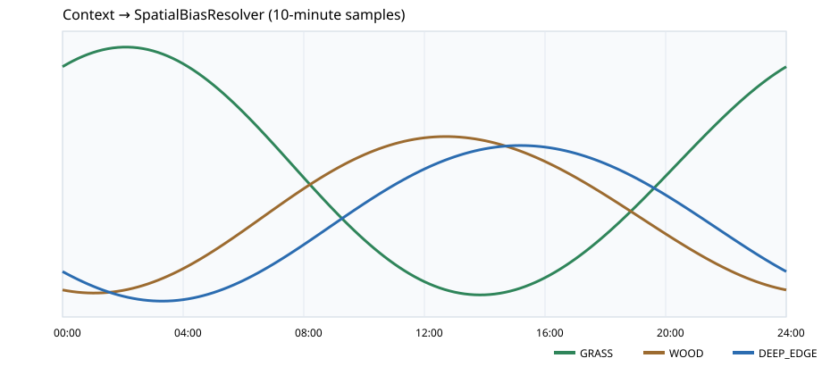

# Bass Dynamic Preference｜Prototype Gate Validation

Document status：**RETAINED / PROTOTYPE GATE EVIDENCE**  
Authority：**V0 executable validation only; not an FCF V1 contract**  
Scope：`bass_dynamic_preference` prototype gates listed in this report.  
Reproduction：`python3 -m bass_dynamic_preference.run_prototype` and the pytest command below.  
V1 promotion rule：requires an explicit V1 owner decision and scoped review; this report cannot promote itself.  
Verdict：**PASS WITH DELTA**（仅覆盖本报告列出的 gates）

本页只补充 `bass_dynamic_preference` 原 executable fixture harness 尚未覆盖的 Prototype Gates；不重新证明既有三时段策略故事。全部系数、概率与阈值均为 **TEST FIXTURE / TUNING PLACEHOLDER / NOT AUTHORITY**。

复现：

```text
python3 -m bass_dynamic_preference.run_prototype
PYTHONPATH=. pytest -q tests/test_bass_dynamic_preference.py
```

机器可读结果：`bass_dynamic_preference/prototype_output/prototype_results.json`。共享地图：`bass_dynamic_preference/prototype_output/generated_map.json`。连续 Resolver 图：`bass_dynamic_preference/prototype_output/continuous_spatial_bias.svg`。

## 1. Coverage Audit

### Before

原 harness 只有 3 个本功能测试：

1. `test_three_epoch_spatial_reorders_without_global_gain`
2. `test_three_epoch_feeding_reorders_without_appetite_gain`
3. `test_default_neutral_conditions_are_explicit`

此前的 `79 passed` 中，其余 76 个为旧 repo 的 FCF V1 / calibration tests。Prototype Gate 要求的 fragmentation、unrelated-source、continuous resolver、feeding resolver 和 O0/O1 tests 当时均不存在。

### After

本功能现有 11 个 tests：保留原 3 个，新增 8 个。其中要求指定名称的 tests 已存在：

- `test_fragmentation_invariance_g1`
- `test_fragmentation_invariance_g2`
- `test_fragmentation_invariance_g3`
- `test_unrelated_source_does_not_change_existing_region`
- `test_context_change_is_smooth`

另新增 feeding common-mode、G1/G2/G3 map 和 O0/O1 Monte Carlo 三项验证。

## 2. Spatial Granularity｜G1 / G2 / G3

共享生成地图：3 zones × 3 habitat-use classes × 每格 5 个 SourceGroups，共 45 个生态 SourceGroups。三种 Granularity 使用同一地图、Context 与 Static Habitat Preference。

| Metric | G1: Class | G2: Zone × Class | G3: SourceGroup |
|---|---:|---:|---:|
| Authoring parameter count | 3 | 9 | 45 |
| Runtime bias entries | 3 | 9 | 45 |
| 可表达 pattern identities | 3 | 9 | 45 |
| 可表达局部 pattern | class-global only | zone × class | individual SourceGroup |
| Far-distance coupled identities | 10 | 0 | 0 |
| Same-zone map edit max existing-bias delta | 0 | 0 | 0.011326 |
| Map-edit stability | STABLE | STABLE | COUPLED_WITHIN_CENTERING_SCOPE |
| Debug identity count | 3 | 9 | 45 |

实测解释：

- **G1：**成本最低，但无法表达 `NORTH/GRASS` 局部变化而不同时改变其它 zone 的 GRASS；本 fixture 中联动 10 个远端 SourceGroups。
- **G2：**9 个参数即可表达 zone-local class pattern；远端不同 zone 不耦合，新增同类 Source 不改变 key set 或既有 Bias。
- **G3：**局部表达最强，但 authoring/runtime/debug identity 都增至 45；同一 zone 新增 SourceGroup 会改变该 zone 的 centering population，使既有 Bias 最大漂移 0.011326。

本 fixture 的证据支持 **G2 是三者中最低成本且同时满足局部表达、远端独立与 map-edit stability 的方案**。这不是跨地图或正式 Authority promotion；G1/G3 的失败/代价继续保留。

## 3. Fragmentation Invariance

生态 Source `A(weight=1.0)` 与十个技术对象 `A1...A10(weight=0.1)` 都先按稳定 `source_group_id=A` 聚合，再应用对应 Granularity Bias。

| Granularity | One object Local / Exposed | Ten fragments Local / Exposed | Max delta | Verdict |
|---|---:|---:|---:|---|
| G1 | 76.234678 / 60.987742 | 76.234678 / 60.987742 | 1.42e-14 | PASS |
| G2 | 77.603846 / 62.083077 | 77.603846 / 62.083077 | 1.42e-14 | PASS |
| G3 | 77.175826 / 61.740661 | 77.175826 / 61.740661 | 0 | PASS |

G3 没有天然失败：其语义 key 是 ecological `SourceGroup`，不是 renderer/geometry technical object。若 A1...A10 被错误赋予十个新的 SourceGroup IDs，变化将是语义 authoring 变更，而不是技术 fragmentation；本实现不把这两者混为一谈。

**Fragmentation: PASS**

## 4. Unrelated Source Independence

对既有 `NORTH.GRASS.00` 记录 intensity，再加入远处不同 zone 的 `REMOTE.WOOD.00`：

| Granularity | Before Local / Exposed | After Local / Exposed | Delta | Verdict |
|---|---:|---:|---:|---|
| G1 | 60.987742 / 43.911174 | 60.987742 / 43.911174 | 0 | PASS |
| G2 | 62.083077 / 44.699815 | 62.083077 / 44.699815 | 0 | PASS |
| G3 | 57.293150 / 41.251068 | 57.293150 / 41.251068 | 0 | PASS |

G3 的 centering scope 是 zone，因此不同 zone 的 Source 不耦合；同 zone 插入仍会发生上一节记录的 0.011326 map-edit drift。

**Unrelated Source Independence: PASS**

## 5. Continuous Context → SpatialBiasResolver

Resolver 输入实际包含：

```text
time_of_day
light
water_temperature
temperature_trend
wind
```

它直接产生 GRASS、WOOD、DEEP_EDGE 的 centered relative Bias。一天按 10 分钟采样，共 145 个 samples；相邻任一 class 的最大 Bias 变化为 `0.010594`，低于测试阈值 `0.02`。



Resolver 和输入本身连续，未使用 Morning/Midday/Evening lookup、Epoch interpolation 或 hysteresis。

**Continuous Resolver: PASS**  
**FishConditionEpoch Needed: NO**  
**NO ADDITIONAL EPOCH TRANSITION STRUCTURE NEEDED**

`FishConditionEpoch` 仍可作为描述性分析词，但本 Prototype 不需要对应 Runtime object。

## 6. PreyState → DynamicFeedingPreferenceBias

测试输入：

```text
base    = (baitfish=.7, crustacean=1.3, worm=.9)
uplift  = (baitfish=1.4, crustacean=2.6, worm=1.8)
```

两者只相差统一的 ×2 common-mode activity uplift。centered resolver 对两者都输出：

```text
BAITFISH    0.730435
CRUSTACEAN  1.356522
WORM_LIKE   0.939130
```

最大 Bias delta 为 `0`。common-mode prey activity 不会成为 global appetite uplift；总体 feeding drive 继续由独立 owner 表达。

**Feeding Preference Resolver: PASS**

## 7. O0 / O1 Player Observation Experiment

搜索 Agent 只读取公开 Observation；没有任何代码路径向 Agent 暴露 SpatialUseBias、FeedingPreferenceBias、LocalIntensity 或 FeedingMatch。

- O0：`NO_EVENT / BITE`
- O1：`NO_PRESENCE_SIGNAL / PRESENCE_SIGNAL / FOLLOW_OR_REJECT / ATTACK`
- 搜索空间：3 zones × 3 food families
- Monte Carlo：2,000 trials，固定 seed `20260902`

| Metric | O0 | O1 | Difference |
|---|---:|---:|---:|
| 找到最佳 Zone 的平均 probes | 23.23 | 19.48 | O1 -16.1% |
| 找到最佳 food family 的平均 probes | 22.16 | 34.26 | O1 +54.6% |
| Mean total probes | 45.38 | 53.74 | O1 +18.4% |
| 最终正确识别率 | 36.95% | 73.40% | +36.45 pp |
| Presence 误判为 Response | 58.21% | 0% | -58.21 pp |
| Probes per correct pattern | 122.82 | 73.21 | O1 -40.4% |

不得隐藏的负结果：O1 为了积累“存在条件下的 food response”证据，平均 food probes 和 raw total probes 更高。它不是无条件让每一步都更快。

但相同极简 Agent 下，O1 将正确识别率近乎翻倍，完全消除本 fixture 中 Presence→Response 误判，并将每次成功识别的等效 probe 成本降低 40.4%。因此分离信息显著降低的是**获得正确模型的学习成本**，不是所有原始采样计数。

**Presence/Response separated feedback worth preserving: YES**

这只验证信息价值，不设计最终 UI，也不要求新增机制层。

## 8. Gate Results and Verdict

```text
G1:
  lowest cost, but FAILS zone-local expression without far coupling

G2:
  9 authoring/runtime/debug identities
  local pattern expression = PASS
  far-distance independence = PASS
  map-edit stability = PASS in this fixture

G3:
  maximum local expression
  fragmentation = PASS
  far-distance independence = PASS
  same-zone map-edit stability = DELTA (max bias drift 0.011326)
  authoring/runtime/debug cost = 45 identities

Fragmentation: PASS
Unrelated Source Independence: PASS
Continuous Resolver: PASS
FishConditionEpoch Needed: NO
O0 vs O1: 36.95% vs 73.40% correct; 58.21% vs 0% Presence→Response error
Presence/Response separated feedback worth preserving: YES
```

### Prototype Verdict: PASS WITH DELTA

## Scoped verdict

```text
level: ARTIFACT
scope:
  - docs/bass_dynamic_preference_prototype_validation.md
baseline:
  - bass_dynamic_preference executable prototype and listed prototype gates
  - scoped_review_protocol.md default PATCH/ARTIFACT rules
proves:
  - 本报告列出的 fragmentation、unrelated-source、continuous resolver、feeding resolver 和 O0/O1 gates 有可复跑证据
does_not_prove:
  - V1 Authority、跨地图 promotion、production runtime 或完整机制闭合
open_findings:
  - 本报告标注的 PASS WITH DELTA 项仍需后续产品/证据裁决
verdict: ARTIFACT_REVISE
```

已通过的 Prototype Gates：三种 granularity 均保持 technical fragmentation invariance；远处不同 zone Source 不改变既有区域；Context resolver 连续；common-mode prey uplift 不侵犯 appetite owner；O1 分离反馈有量化价值。

保留的 Delta / Evidence：

1. G1 不足以表达 zone-local pattern，不应作为本地图的完整 target。
2. G3 在同 zone centering scope 内存在 map-edit coupling，并支付 5× G2 的 authoring/runtime/debug identity 成本。
3. O1 提高正确性但增加 raw food probes；其收益是降低 correct-pattern cost，而不是保证每项 probe metric 都下降。
4. G2 只在这份 45-Source fixture 中表现最好；正式采用仍需其它地图密度与不均匀 Source 分布验证。

没有证据要求新增 FishConditionEpoch Runtime object、interpolation、hysteresis、FishMode、FSM 或 global appetite score。
