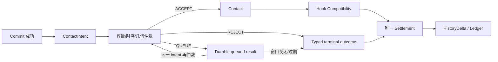

# FCF V1 Contact / Hook 机制设计（Design-only）

Contact 与 Hook 都发生在 Commit 之后，但解决不同问题：Contact 决定“谁能
占用这个接触窗口”，Hook 决定“已经发生的接触是否满足装备/嘴部/时序兼容”。
二者都不是 Entry，也不重新解释温度、DO、流速或鱼的 motive。

## 0. 快速阅读

**概念**：Contact 负责接触窗口的容量和仲裁；Hook 负责已发生接触与嘴部、装备、
几何和时序是否兼容；Settlement 负责唯一终结记账。

**整体机制**：Commit 成功产生稳定 ContactIntent；Contact 按时间/几何/稳定 tie
identity 仲裁，每个 Candidate×window 最多一个有效 intent；Hook 只消费下游兼容
输入；最终由唯一 settlement transaction 归还、迁移、恢复或移除质量。

**配置方式**：配置 ContactType repertoire、window/capacity、arbitration order、
mouth/rig/geometry compatibility、terminal mapping 和 transaction identity；不能
在这里修改 PSU 或 History。

**中文机制描述**：先决定“谁在这个窗口里真正碰到了目标”，再判断“这次接触
是否满足挂钩条件”，最后只结算一次；失败重试不能产生第二次接触或第二次扣鱼。



## 1. 前置状态

只有以下链路成立后才允许 Contact：

```text
Candidate materialized
→ deterministic Encounter Conversion
→ COMMIT_READY
→ one Commit decision succeeds
→ ContactIntent
```

Pending proposal、未 reservation 的对象、Commit 失败或已 terminal 的 Candidate
都不得生成 ContactIntent。

## 2. ContactIntent

```text
ContactIntent {
  intent_id                  stable semantic ID
  candidate_id
  contact_type               declared Species repertoire
  contact_window_id
  event_time
  contact_point / geometry
  semantic_intent_id?        required for abstract ties
  capacity_class?            V1 fixed to DEFAULT; no per-class capacity
  snapshot_fingerprint
}
```

ContactIntent 是 Commit 成功后的事实性请求，不保证一定获得接触。它必须
携带 Candidate snapshot 和稳定 identity，不能每帧重建一个新 intent。

## 3. Contact arbitration

对同一 `contact_window_id`，arbitrator 只做容量裁决：

```text
eligible intents
→ discard expired/invalid intents
→ order by (event_time, geometry priority, stable tie-break)
→ accept up to capacity
→ reject/queue remainder with typed reason
```

规则：

- `event_time` 与 geometry priority 必须来自 snapshot，不能由处理顺序决定；
- 同一 `candidate_id × contact_window_id` 至多一个有效 intent；重复 intent
  必须被去重并产生 typed rejection，若同一 pair 携带不同 payload 则拒绝为
  identity conflict，不能占用第二个 capacity slot；
- 抽象 tie 必须提供 `semantic_intent_id`，否则拒绝为 contract ambiguity；
- stable tie-break 使用 intent/candidate 的稳定 identity，不使用 runtime object ID；
- arbitration 不改变 PSU、不重掷 Commit、不重算 Encounter；
- rejected intent 必须产生 typed outcome，后续由 Settlement/History owner 处理。

Arbitration 本身也是可持久化事务：

```text
arbitration_transaction_id = stable(window_id + candidate/intent identities + snapshot)
→ durable ACCEPT/REJECT/QUEUE result
```

同一 transaction_id + 相同 payload 重放必须返回原结果，不得再次占用 slot；
同一 transaction_id + 不同 payload 必须拒绝为 conflict。结果 journal 写入
成功但响应丢失时，重试只能读取原结果。

容量属于 Contact owner；“鱼是否值得接触”属于前置 Encounter/Commit，不能
在 arbitrator 内偷偷加一个 preference score。

## 4. ContactType 选择

ContactType 只能从 Species capability 的 `allowed_contacts` 中选择，并由
Encounter snapshot 或明确的 Contact policy 决定。Variant 不能新增 ContactType。

```text
contact_type = select_declared_contact_type(
  species_capability, presentation_truth, encounter_snapshot
)
```

选择必须确定性；若多个类型同优先级，编译期要求显式 priority 或 stable
tie-break，不能依赖枚举顺序。

## 5. Hook compatibility

Hook 只读取接触后的下游事实：

```text
HookInput {
  contact_type
  mouth_geometry
  hook_geometry
  rig/tension/timing
  contact_point
  contact_duration
}
```

```text
hook_compatibility(inputs) → HOOKED | SLIP | NO_CONTACT
```

Hook 不读取 raw item ID 作为鱼响应权威，不重新使用 temperature/DO/flow，
不修改 `A`、`E`、Occupancy 或 PSU。`NO_CONTACT` 只能表示 arbitration 未
分配接触窗口；`SLIP` 表示接触发生但几何/时序不兼容；二者必须区分。

## 6. Settlement 与 History

Contact/Hook 只输出 typed outcome：

```text
contact outcome
→ one settlement transaction
→ one HistoryDelta (if declared)
→ idempotent terminal state
```

Contact owner 不能直接应用 HistoryDelta；Hook owner 不能直接移动 PSU。所有
terminal mutation 由 Settlement owner 通过 transaction_id 完成。

## 7. 并发、重放与时序

- 同一 intent_id 重放必须返回相同 arbitration 结果；
- 同一 contact_window 的并发 intents 必须在一个 arbitration transaction 内裁决；
- Contact 结果写入成功但响应丢失时，重试不得再占一个 capacity slot；
- 已 settle 的 Candidate 的 Contact/Hook 请求只返回 terminal/expired；
- contact window 关闭时，未接触 intents 不能被重新转成新的 Entry opportunity。

## 8. 编辑器

编辑器必须提供：

1. Commit boundary view：显示 Commit 成功才允许 ContactIntent；
2. Contact window/capacity panel：窗口、容量、event-time、geometry priority；
3. Tie-break panel：semantic_intent_id 和 stable ordering；
4. ContactType panel：Species repertoire、priority、Variant 限制；
5. Hook panel：mouth/hook/rig/timing 输入和 `HOOKED/SLIP/NO_CONTACT` 输出；
6. Settlement/History panel：typed outcome、transaction_id、delta owner；
7. Replay trace：同 intent/window 重放的相同结果。

编辑器禁止把 arbitration preference 当作新的 motive/E，禁止允许 Hook 读取
raw item ID 作为鱼类语义，禁止新增未声明 ContactType。

## 9. 关键反例

1. Commit 失败仍生成 ContactIntent；禁止。
2. 两个 intent 以 runtime object ID tie-break；禁止，必须稳定 identity。
3. arbitrator 用“更饥饿/更像目标鱼” preference score 抢容量；禁止。
4. Hook 失败被写成 Entry deny；禁止，必须区分 `SLIP` 与 `NO_CONTACT`。
5. Contact 成功后再次扣 PSU 或直接应用 HistoryDelta；禁止，Settlement/History owner 负责。
6. contact window 关闭后把未接触 intent 重新 roll 成 Entry；禁止。

## 10. 最小闭合结论

```text
Commit success
→ stable ContactIntent
→ capacity arbitration
→ downstream Hook compatibility
→ one terminal Settlement
```

Contact/Hook 在 identity、capacity transaction、ContactType capability 和
terminal owner 未闭合前，不应实现成一个混合的“咬钩概率”函数。
