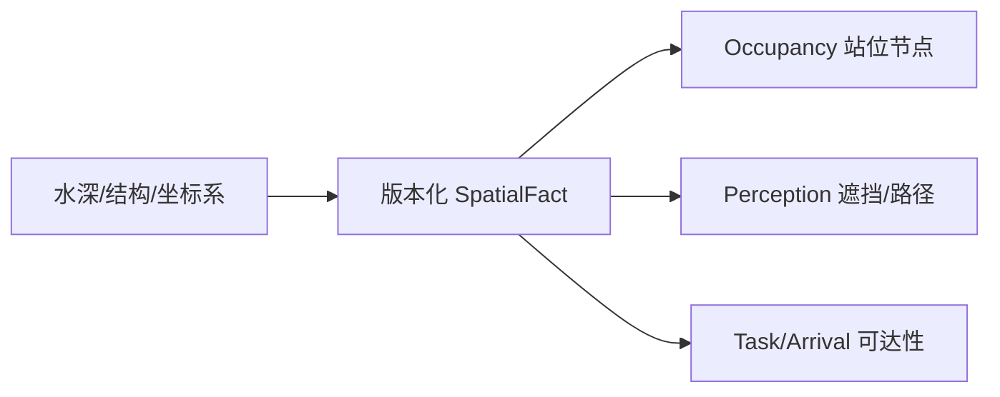

# FCF V1 深度与结构机制设计（Design-only）

深度和结构首先定义空间几何与栖息节点，不是一个“鱼更容易咬”的 bonus。
V1 必须把空间事实、鱼的站位选择、presentation 可达性和遮挡分开。

## 0. 快速阅读

**概念**：深度与结构是版本化空间几何事实，定义节点、边界、掩体和可导航体积。

**整体机制**：SpatialFact 固定 geometry/frame revision；Occupancy 选择可停留节点，
Perception 消费遮挡/路径结果，Task/Arrival 消费可达路径，彼此不改写同一后果。

**配置方式**：配置 bathymetry、structure geometry、cover tags、navigation volume、
coordinate frame 和 revision；Species 配置深度/通过能力；Program 配置站位策略。

**中文机制描述**：先构造“水下空间是什么样”，再分别判断“鱼能否站在那里”、
“玩家信号是否可达”和“动作路径是否可执行”，不能用结构 bonus 代替几何。

**作者成本 companion evidence**：深度/结构边界与草区、阴影、温度和 DO 叠加
时，静态手工 Region 的交叉切割压力见
[Ogre Lake experiment](ogre_lake_manual_region_companion_experiment.md)。该实验
只说明 authoring cost，不改变本机制的 owner 或 closure 结论。



## 1. World Fact

```text
SpatialFact {
  node_id
  bathymetry_depth_m
  structure_geometry_id
  boundary_mesh_revision
  cover_tags
  navigable_volume
  local_coordinate_frame_id
  measured_at / source_revision
  quality / uncertainty
}
```

`depth_m` 是节点几何事实；`structure_geometry_id` 指向版本化碰撞/遮挡
几何。Structure tag 只能是物理描述（例如 ledge、vegetation、rock），不
能写成 `GOOD_FOR_BASS` 等鱼类解释。
`structure_geometry_id`、`boundary_mesh_revision` 和
`local_coordinate_frame_id` 会直接影响 line-of-sight、actionability 和
path，因此必须与 `source_revision` 一起进入 Opportunity semantic
fingerprint；mesh/frame 更新不能静默改变 replay 结果。

## 2. 四种后果与 owner

### 2.1 Spatial identity（Geometry owner）

节点、深度和可航行体积决定 `population_slice_key` 的空间作用域。它们不
改变 PSU，只决定事实落在哪个 node/slice。

### 2.2 Occupancy（Population owner）

```text
w_structure = habitat_profile(depth, cover, navigable_volume, slice_policy)
```

它只影响长期节点质量，再由 Occupancy allocator 做归一化、cap 和
conservation。Occupancy 不触发迁移 transaction，也不直接降低 `A` 或 `E`。

### 2.3 Perception / hard actionability（Geometry semantic owner）

```text
visibility_geometry = line_of_sight(structure_geometry, path)
actionable = capability_gate(approach_volume, task_envelope)
```

几何遮挡的 semantic owner 是 Geometry/Presentation relation；Perception
只消费其结果计算 `A_visual`，TaskCapability gate 只返回 `ACTIONABLE/BLOCKED`。
该 gate 输出必须带 `consequence_id`、owner、stage、输入 revision 和 block
reason。它们不拥有长期鱼量，也不改变 `E`。

### 2.4 Arrival/T（Path owner）

只有结构或深度真实改变 presentation path/arrival time 时，Path/Arrival
owner 才能计算 `T`。若运动系统已提供确定 path/arrival time，FCF 不得再次
用深度或结构重算 arrival bonus。

## 3. 计算边界

### 3.1 深度

深度本身不是“越深越少鱼”的公式。它可被不同 Species 的 habitat profile
解释为长期适宜性，也可作为取温度/DO/flow profile 的空间索引；索引行为
不是第二个 penalty。

### 3.2 结构

Structure geometry 至少要区分：

```text
cover_volume       可藏身体积
occlusion_surface  视线遮挡面
passage_width      可通过宽度
current_boundary   局部流场边界
```

这些是不同物理后果，只有真正被不同下游阶段消费时才可拆成不同
`consequence_id`。同一遮挡面不能既降低 A、又以“鱼不在”降低 Occupancy。

## 4. 不确定性与安全

- 几何 revision 明确且误差在边界内：`DEFINITE_GEOMETRY`；
- path/mesh uncertainty 穿过可通过/不可通过边界：`GEOMETRY_RISK`，禁止
  新 Entry/Reservation/lifecycle enter；
- fact `UNKNOWN`：V1 不新增该 node 的 Occupancy 质量、不生成新 Candidate，
  保留已有 Slice，并在 trace 写入 `UNKNOWN_DATA_BLOCK`；
- 不因 geometry uncertainty 随机销毁已有 Candidate。

Safety gate 必须在任何新 Entry、Reservation 或 lifecycle-enter 写入前执行。

## 5. 与环境因子的组合

| 事实 | 允许消费 | 禁止重复 |
|---|---|---|
| depth | 位置索引、habitat profile | 先扣 occupancy 再扣 A 的“深度惩罚” |
| structure cover | occupancy 或 concealment（不同 consequence） | concealment 又写成鱼不存在 |
| occlusion geometry | A_visual / actionability | 再由 E 扣同一遮挡 |
| passage width | task/path feasibility | 与 flow/DO 对同一“到不了”后果双扣 |
| current boundary | canonical FlowFact | 结构和 flow 再各扣同一阻力 |

组合必须遵守 `fact → distinct consequence → one owner → stage`。

## 6. 编辑器

编辑器拆为：

1. Spatial Fact source：深度、mesh、节点、坐标系、revision、uncertainty；
2. Habitat policy：Species/Slice 对深度、cover、volume 的长期解释；
3. Geometry relation：path、遮挡、通行体积和 presentation relation；
4. Task capability gate：task envelope、approach volume、blocked reason；
5. Arrival model：是否由外部运动系统提供 path/arrival；
6. Owner graph/trace：显示空间事实如何进入 Occupancy、A、Actionability 或 T。

任何 tag 若包含鱼类判断、任何 geometry 修改若改变 capability，都必须
被编译器拒绝或标为 capability/scale change；Variant 不能新增通行能力。

## 7. 反例

1. 深度从 4m 变 6m，每帧重建 slice 并产生新 Entry；禁止，必须稳定 node/slice key。
2. 结构遮挡降低 `A_visual`，又降低 Occupancy 作为“鱼离开”；同一后果禁止双扣。
3. 外部 path 已给出到达时间，FCF 再从深度重算 `T`；禁止。
4. mesh uncertainty 穿过通行边界却随机选择可通行；应输出 `GEOMETRY_RISK` 并阻断新进入。
5. Structure tag 写成 species-specific interpretation；禁止。

## 8. 最小闭合结论

```text
Spatial facts
→ node identity / habitat / geometry relation / arrival path
→ distinct consequence_id
→ one owner
→ deterministic downstream use
```

深度与结构在稳定空间 identity、几何 revision、path 归属和 owner 图未闭合
前，不应实现成一个全局 `depth_structure_multiplier`。
