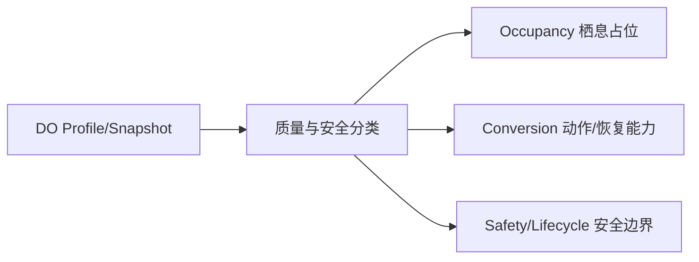

# FCF V1 溶解氧（DO）机制设计（Design-only）

> 作者成本旁证：DO 阈值轮廓与 Depth、Temperature 等边界不完全重合时，
> 静态手工 Region 的进一步切分见
> [Ogre Lake companion experiment](ogre_lake_manual_region_companion_experiment.md)。
> 该实验不改变本机制的 owner、safety 或计算契约。

DO 是水体事实，不是“鱼活跃度”或“咬口率”。V1 先把它拆成数据事实、
栖息占用、动作性能和安全边界四个问题，再决定是否需要任何原型。

## 0. 快速阅读

**概念**：DO 是带空间、深度、时间、质量与 uncertainty 的溶解氧事实。

**整体机制**：DO snapshot 先做安全/UNKNOWN 分类，再由不同 owner 解释为长期
栖息适合度、已在场鱼的持续运动/恢复能力或急性安全边界；默认不直接修改 A/E。

**配置方式**：World Fact 面板配置 DO profile、单位、深度层和数据质量；Species
面板配置 lethal/stress/preferred/recovery/exertion capability；Program/Slice 配置
avoidance threshold、occupancy/task/safety policy，不能扩展物种边界。

**中文机制描述**：先问“水里实际有多少氧”，再分别回答“鱼是否适合待在这里”
和“已经在这里的鱼还能否持续动作”，不能用同一个低氧 penalty 扣两次。



## 1. 语义分层

```text
DO snapshot
→ local habitat suitability       (Occupancy owner)
→ exertion / recovery capacity    (Conversion owner)
→ acute viability guard           (Safety/Lifecycle owner)
```

DO 默认不直接进入 Perception `A` 或 Entry `E`。如果低 DO 造成的是“该节点
长期不适合停留”，由 Occupancy 结算；如果鱼已经在场但持续追击能力下降，
由 Encounter Conversion 结算。两者不能用同一个 penalty 重新扣一次。

## 2. 数据事实

### 2.1 Canonical snapshot

```text
DissolvedOxygenFact {
  value_mg_l
  measured_at
  location_id
  depth_m / profile_id
  water_temperature_revision
  salinity_or_pressure_basis
  source_kind = SENSOR | HYDRO_MODEL | MANUAL_CALIBRATION
  quality = DIRECT | INTERPOLATED | STALE | MISSING
  uncertainty_mg_l
  source_revision
}
```

DO 的溶解度受温度、盐度和压力影响，但这些是测量/校准输入，不意味着
下游可以再把同一个温度后果重复解释一次。必须保留原始 DO 与校准后的
canonical 值，不能由鱼 resolver 自己“根据温度猜 DO”。

### 2.2 空间与时间

DO 必须按 `location × depth × causal_cut` 取 snapshot。不能用水面 DO
替代底层或热跃层以下 DO。短时传感器缺口可在同一 profile 内插值，但
跨越分层边界时必须标记 `UNKNOWN` 或 `STALE`，不能静默平均。

同一 causal cut 内所有 resolver 必须读取相同 `source_revision`；该 revision
进入 Opportunity semantic fingerprint，确保 replay 不会因数据更新而偷偷
产生新 roll。

## 3. 鱼的属性与编辑边界

### 3.1 Species capability

```text
OxygenCapability {
  lethal_min_mg_l
  stress_min_mg_l
  preferred_min_mg_l
  recovery_rate_profile_id
  exertion_sensitivity_profile_id
}
```

这些字段描述物种/体型/生命阶段的生理能力。Variant 不能把 lethal boundary
改成物种未声明的能力；cohort 差异应通过独立 Species capability 或明确的
cohort profile 表达，而不是运行时随意乘系数。

### 3.2 Program / Slice policy

```text
OxygenPolicy {
  occupancy_mode
  avoidance_threshold_mg_l
  hysteresis_mg_l
  minimum_hold_s
  task_profile_id
}
```

Policy 只决定当前 Slice 如何使用能力（例如是否积极离开低氧区），不扩大
生理边界，也不把低氧转成 universal entry penalty。

### 3.3 History

```text
OxygenHistory {
  exposure_integral
  recent_min_mg_l
  recovery_debt
  last_transition_at
}
```

历史在 END-CUT 更新；Candidate snapshot 后，不能被后续实时 DO 读数悄悄
改写。`recovery_debt` 只由 recovery owner 结算，不能再由 occupancy owner
扣一次。

## 4. 可审计判断函数

V1 采用分段函数，避免未经校准的指数系数堆：

```text
occupancy_band(O; O_avoid, O_pref) =
  0                 O ≤ O_avoid
  ramp(O_avoid → O_pref)  O_avoid < O < O_pref
  1                 O ≥ O_pref
```

其中 `O_avoid` 是长期停留的 avoidance threshold，`O_pref` 是 preferred minimum；
二者都高于 `lethal_min`。`lethal_min` 不参与 occupancy 权重，只归 acute
safety owner。这样 occupancy 的零权重只是长期分布预分配，不会与运行时
安全阻断或迁移共享“鱼不得存在”的结算权。

### 4.1 Occupancy

```text
w_oxygen = occupancy_band(O_local, O_avoid, O_pref)
```

它只进入 Occupancy allocator。allocator 负责 cap、归一化和 PSU conservation；
DO resolver 不直接创建/销毁鱼，也不触发 Entry roll。

### 4.2 Task performance

```text
p_exertion = exertion_profile(O_local, recovery_debt, task_id)
```

它只影响已 materialized Candidate 的 pursuit duration、burst budget 或
recovery time。若 task profile 已表达“低氧导致爆发能力下降”，Entry/E 不得
再次表达同一结果。

### 4.3 Acute safety

若 DO 测量区间明确落入 lethal 区域，Safety/Lifecycle owner 才能发出
`DEFINITE_HYPOXIA`；在事实明确前不得随机移除鱼。若 uncertainty 与 lethal
区域相交，采用 `HYPOXIA_RISK`：

- 禁止新的 Entry、Reservation 和 lifecycle enter；
- 不追溯销毁已有 Candidate；
- trace 记录区间、boundary、quality、source revision 和阻断原因；
- 下一 causal cut 明确安全/致死后，才恢复或执行已声明策略。

## 5. 与温度、流速、深度的交互

交互必须先问“是否是不同物理后果”：

| 因素 | 允许的主要 owner | 禁止的重复解释 |
|---|---|---|
| 温度改变 DO 测量溶解度 | 数据校准 | 再把同一变化作为低氧 penalty |
| 深度导致 DO profile 差异 | local Occupancy / geometry | 同一深度缺氧再扣一次 A |
| 流速改变补氧/能量成本 | 明确的 flow 或 task owner | 同一“追击更难”同时扣 flow、DO、E |
| 温度影响代谢率 | task performance profile | 同一代谢后果再扣 DO performance |

每条 trace 必须展示：

```text
physical fact → semantic interpretation → sole owner → downstream consumer
```

如果无法证明是两个不同的物理后果，默认只保留一个 owner。

## 6. 不确定性和缺失数据

相对于 lethal boundary，区间完全在安全侧为 `DEFINITE_SAFE`，完全在致死
侧为 `DEFINITE_HYPOXIA`，相交为 `HYPOXIA_RISK`，无可接受 snapshot 为
`UNKNOWN`。

`UNKNOWN` 不得被替换成 Species 平均值。V1 默认采用“保守不生成新
Candidate，保持已有 Slice，等待下一 causal cut”的策略，并在 trace 中
标记 `UNKNOWN_DATA_BLOCK`；产品若要放宽，必须作为显式 policy 版本化。
`HYPOXIA_RISK` 不是随机 death roll。

## 7. 编辑器

温度与 DO 的编辑器可以共享框架，但不能共享隐含系数：

1. **Fact source panel**：传感器、单位、profile、质量、uncertainty、revision；
2. **Species capability panel**：lethal/preferred/recovery/exertion profile；
3. **Slice policy panel**：occupancy、hysteresis、minimum hold、task profile；
4. **Cause-owner panel**：显示 DO、temperature、flow、depth 各自的 sole owner；
5. **Trace panel**：展示 `w_oxygen`、`p_exertion`、safety classification 及
   受影响的下游阶段。

保存时必须区分 `WORLD_SOURCE_CHANGE`、`CAPABILITY_CHANGE` 和
`POLICY_CHANGE`；capability 或 `q` 变化需要 recalibration/reviewer sign-off。

## 8. 关键反例

1. 水面 DO 高、底层 DO 低，却使用全局平均值；禁止。
2. 低 DO 降低 occupancy 后又降低 E；若是同一“鱼不在/不愿开始”的后果，禁止。
3. 传感器不确定性每帧触发新 Candidate；禁止，必须 causal-cut + stable ID。
4. 低 DO 让 Candidate 追击时间变短，同时又减少一次 Entry；禁止重复 owner。
5. Variant 将低氧耐受提高到 Species capability 之外；禁止。
6. 温度→代谢、DO→代谢被当成两个独立 penalty，但没有可区分的 task 后果；
   默认合并为一个声明清楚的 performance profile。

## 9. 最小设计结论

```text
DO fact snapshot
→ deterministic classification
→ occupancy OR task performance OR acute safety
→ one owner, one downstream settlement
```

在数据 profile、uncertainty、Species capability 和 cause-owner 矩阵没有
闭合前，不应实现一个名为 `oxygen_multiplier` 的全局参数。
