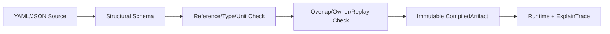

# FCF V1 Authoring DSL 语义设计（Design-only）

FCF DSL 是声明式 contract，不是脚本语言。它描述事实绑定、Species 能力、
Slice policy、resolver 规则、owner 和 trace metadata；不能表达任意执行流，
也不能把最终“鱼是否咬”写成一个可调系数。

## 0. 快速阅读

**概念**：FCF DSL 是版本化、声明式、fail-closed 的机制配置语言，不是脚本。

**整体机制**：YAML/JSON 依次经过结构校验、引用解析、能力/单位校验、规则 overlap、
owner 唯一性和 replay 检查，最后生成 immutable `CompiledArtifact`。

**配置方式**：分别配置 World Facts、PopulationDefinition、Species、Slices、Programs、
Variants、resolver rules、owner matrix 和 trace contract；未知字段或未解析引用失败。

**中文机制描述**：作者只能描述“事实、能力、策略和规则”，不能在配置里写任意
程序、隐藏随机数或最终咬口系数；所有歧义在发布前被编译器拒绝。



## 1. 顶层命名空间

```text
schema_version
world_facts
species
population_slices
programs
variants
settlement_owners
resolver_rules
trace_contract
```

每个 namespace 有独立 identity、版本和 owner。Program 不得嵌入
`population_slice_key`；Variant 不得改变 Species capability 或 `q`。

## 2. 编译阶段

```text
parse YAML/JSON
→ structural schema validation
→ identity/reference resolution
→ capability/type/unit checks
→ rule overlap and owner uniqueness checks
→ temporal/replay contract checks
→ immutable CompiledArtifact + diagnostics
```

任一 semantic error 都阻止编译；不能“尽量编译然后运行时再猜”。编译输出
必须携带 source paths、artifact version、input revisions 和 diagnostics。
Structural schema 对未知 root 或 nested field 一律拒绝；parser 不得静默
丢弃未声明字段，否则同一 artifact 会被不同实现解释成不同语义。

## 3. 类型系统与边界

DSL 值至少有以下 semantic types：

```text
WorldFact<T, revisioned>
SpeciesCapability<T, immutable>
Policy<T, slice-scoped>
HistoryField<T, end-cut>
Probability<A/T/E or declared decision>
ConsequenceId
OwnerId
TriggerIdentity
```

类型错误示例：

- 用 `WorldFact` 直接写入 Species capability；
- 用 `HistoryField` 作为新的 Population PSU；
- 把 `A/T/E` 当通用 bonus 相乘；
- 用 Program policy 新增 Species 未声明 ContactType/task；
- 用 `ConsequenceId` 同时绑定两个 settlement owner；
- 将 runtime Candidate/individual ID 写入静态 artifact。

## 4. 可表达与不可表达

### 可表达

- 中性 World Fact 名称、来源、单位、quality、revision；
- Species 的 anatomy/sensory/contact/task capability；
- Slice 的 lifecycle、occupancy、motive/Entry policy；
- 版本化 Variant policy override；
- 明确 priority、trigger、hysteresis、minimum hold；
- 每个 consequence 的唯一 owner 和 trace 字段。

### 不可表达

- 任意循环、递归、隐藏随机数或脚本副作用；
- raw `Fish × Item` terminal coefficients；
- fish-specific World Fact（如 `GOOD_FOR_BASS`）；
- 未声明能力的 Variant 扩展；
- 在 DSL 中直接创建 Candidate、Reservation、Contact 或 Settlement；
- 依赖 map/YAML 字段顺序的语义；
- 通过增加一个新 multiplier 绕过已有 owner。

## 5. 规则语义

每条 rule 必须声明：

```text
rule_id
priority
when: typed predicates over snapshot
requires: capability references
then: one typed output
consequence_id
owner
effective_interval
```

相同 priority 且谓词可能同时为真时编译失败。不同 priority 按数值顺序
选择一个结果；不允许把多个结果相加成隐式 score。`then` 不得跨 namespace
写入状态，只能产生该阶段允许的 typed output。
`effective_interval` 使用半开区间 `[start, end)`，单位和时钟域必须声明；
同一 Program/Slice 内相同 priority 的时间区间只要存在交集就视为 overlap
并拒绝。相邻区间 `[a,b)` 与 `[b,c)` 不重叠；跨 revision 的 interval 不得
静默拼接，必须生成新 policy version。

## 6. Probability contract

概率字段必须标注其语义：

```text
accessibility A
arrival factor T
entry offer E
finite entry draw
commit decision
```

编译器拒绝未标注语义的 `multiplier`、重复 factor owner、以及把同一 fact
同时接到同义 consequence 的路径。真实随机边必须声明 seed identity、replay
输入和消费阶段；Motive/Encounter default deterministic。

## 7. Reference 与 revision

所有引用都必须可解析：

```text
fact_id + source_revision
species_id + capability_version
program_id + policy_version
history_schema_version
geometry/frame revision
trigger identity
```

这些引用组成 semantic fingerprint。引用不存在、版本不兼容或 revision
缺失时编译失败；不能自动取“最近版本”。

## 8. Variant 语义

Variant 是静态、扁平化的 policy artifact：

```text
base Species capability
  + allowed policy overrides
  → flattened immutable variant
```

允许覆盖：motive priority、occupancy policy、EntryOffer、task policy 中已
声明的参数。禁止覆盖：`q`、population identity、anatomy、sensory/contact/task
capability、history schema、settlement owner。任何越权 override 都是编译错误，
而不是 warning。

## 9. 编辑器行为

Editor 不是文本框加保存按钮，而是 DSL 的 typed authoring surface：

1. 根据 semantic type 展示可编辑/只读字段；
2. 每次 edit 在临时 artifact 上编译；
3. 显示 source path、overlap、owner 和 capability diagnostics；
4. 显示 `fact → consequence → owner → stage` 图；
5. 保存只生成新的 immutable artifact version；
6. 输出 compiled artifact、diff、trace preview 和 migration metadata。

Editor 不得自动排序相同 priority、补 owner、把缺失 fact 替成默认值，或
在保存时静默改变 `q`/scale。

## 10. 关键反例

1. 两个 Program 都写同一 Slice 的 terminal behavior；必须在 reference
   resolution 阶段拒绝，而不是依赖加载顺序。
2. Variant 把 `q` 或 lethal capability 改掉；编译失败。
3. `resource_state` 同时进入 occupancy 和 motive，却共用 consequence_id；
   编译失败。
4. 规则通过新 `multiplier` 绕过 A/T/E owner；编译失败。
5. trigger 没有 stable identity/revision；编译失败。
6. DSL 中出现脚本随机或副作用；语言层禁止。

## 11. 最小闭合结论

```text
typed declarative source
→ fail-closed semantic compiler
→ immutable, revisioned artifact
→ deterministic runtime contract
```

DSL 在类型、reference、owner、revision、随机边界和不可表达集合未闭合前，
不应继续增加语法糖或字段数量。
