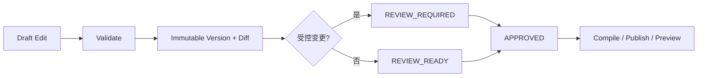

# FCF V1 Editor Interaction / Validation Design

本文件把 schema-driven editor 细化成工程可实现的交互与状态契约。Editor 是
版本化 artifact 的 authoring surface，不是运行时调参控制台。

## 0. 快速阅读

**概念**：Editor 是 DSL 的 typed authoring surface，负责编辑、校验、版本、review、
preview 和 migration，不直接修改生产中的 Candidate 或 ledger。

**整体机制**：每次 edit 在 trial draft 上执行；schema/semantic validation 通过后保存
immutable version；受控变更强制 reviewer approval；runtime 只读取 compiled artifact。

**配置方式**：按 Population、Species、Slice、Program、Variant、World Fact、Owner、
Rule 和 Presentation 面板编辑；Inspector 显示 type、unit、owner、revision impact。

**中文机制描述**：编辑器不替作者猜默认值，也不把错误降级为 warning；它把每项
修改会影响什么、由谁拥有、要重跑哪些验证明确展示出来。



## 1. 页面结构

```text
Artifact selector / version / review status
├─ PopulationDefinition
├─ Species Capability
├─ Population Slices
├─ Behavior Programs
├─ Variants
├─ World Fact Bindings
├─ Consequence Owner Matrix
├─ Resolver Rules
├─ Presentation Compiler
└─ Preview / Explain / Migration
```

右侧 Inspector 对当前字段固定显示：semantic type、unit、owner、source path、
inherited-from、revision impact、validation state。只读字段必须显示为什么只读，
不能仅禁用控件。

## 2. 字段控件与语义

| semantic type | 控件 | 必须显示 | save blocker |
|---|---|---|---|
| physical scalar | 数值 + 单位 | range、uncertainty、source | 单位/范围缺失 |
| bounded interval | 双端点 | inclusivity、包含关系 | inverted/illegal nesting |
| capability enum/set | 多选 | Species allowlist | capability expansion |
| ordered priority | 显式有序列表 | tie/overlap diagnostic | duplicate/equal-priority overlap |
| reference | searchable selector | exact version/revision | unresolved/latest implicit ref |
| policy override | path/value editor | base value、owner、diff | path 不在 allowlist |
| consequence owner | 单选 owner | upstream fact/downstream stage | missing/duplicate owner |
| trigger | typed form | trigger ID、debounce、hysteresis | unstable identity |
| effective interval | `[start,end)` editor | unit、clock domain | overlap/invalid boundary |

世界事实只编辑 source binding、单位、quality 和 revision policy；鱼类解释只在
Species/Program 面板编辑。Editor 不提供 `GOOD_FOR_BASS`、`bite_multiplier` 等
混合字段。

## 3. 继承与 Variant 视图

Variant 页面必须同时显示三列：

```text
base compiled value | requested override | flattened effective value
```

每个 override 先检查 `POLICY_ALLOWLIST`，再检查值是否仍在 Species capability
内。多 patch 同一路径按显式 priority 解析；同 priority 冲突阻止保存。运行时
只接收 flattened artifact，不自行合并。

Capability、PopulationDefinition、owner 与 identity 字段在 Variant 页面只读。
若用户确实要改，Editor 必须引导创建对应的新 boundary revision，而不是把
越权修改包装成 Variant。

## 4. Draft / Validate / Review / Publish 状态机

```text
DRAFT
  → VALIDATING
  → VALID | INVALID
VALID
  → SAVED_VERSION
  → REVIEW_REQUIRED   (controlled change)
  → REVIEW_READY      (only when no controlled change)
REVIEW_READY
  → APPROVED
  → COMPILED
  → PUBLISHED
```

- 任一 edit 在独立 trial artifact 上执行；失败不修改当前 draft；
- `save_as_new_version` 保存完整 snapshot、canonical diff、author、timestamp；
- Capability/scale/owner/history-schema change 自动进入 `REVIEW_REQUIRED`；
- `REVIEW_READY` 只能由 compiler 根据 diff 判定“无受控变更”后产生；用户、
  前端或 API 不得手工把 `VALID`/`SAVED_VERSION` 改成 `REVIEW_READY`；
- 任何受控变更必须沿 `REVIEW_REQUIRED → APPROVED`，缺少 reviewer decision
  时不得 compile/publish；
- APPROVED version immutable；修改必须 fork 新 version；
- runtime 只接受 schema/compiler 通过、review status 满足 deployment policy 的
  `CompiledArtifact`；
- publish 失败不回滚已批准 artifact，只产生 deployment diagnostic。

## 5. 变更分类与影响分析

```text
WORLD_SOURCE_CHANGE
CAPABILITY_CHANGE
POPULATION_SCALE_CHANGE
POLICY_CHANGE
OWNER_CHANGE
HISTORY_SCHEMA_CHANGE
PRESENTATION_COMPILER_CHANGE
```

影响分析至少输出：

- 哪些 semantic fingerprints 失效；
- 哪些 flagship fixtures 必须重跑；
- 是否需要数据 migration/recalibration；
- 已存在 Candidate 是否保持旧 snapshot（V1 必须保持）；
- 哪个 reviewer discipline 被触发。

`q`、population identity、capability、owner、history schema 的变化不能热更新到
现有 Candidate。World source revision 在下一 causal cut 生效；Program/Variant
在下一次合法 materialization 生效。

## 6. Preview / Explain

Preview 必须接受固定输入：

```text
artifact_version
fixture_id
world/history/geometry revisions
scope_id + causal_cut_id
declared random seed identities
```

输出按 stage 展示：

```text
input fact/state
→ classification/derived interpretation
→ consequence_id + owner
→ typed output
→ opportunity/reservation/contact/settlement identity
→ ledger/history delta
```

Preview 是对 authoritative resolver 的只读调用；不得自己做第二次随机 roll、
修改 runtime ledger、补默认 World Fact 或忽略 UNKNOWN。相同输入两次 preview
必须 byte-stable（除非明确排除的展示 metadata）。

## 7. Diagnostics

每条 diagnostic 必须包含：

```text
code, severity, source_path, message,
related_paths[], violated_contract, suggested_action
```

ERROR 阻止 save/compile；WARNING 只允许描述非语义风险（例如数据校准样本少），
不能用于 capability expansion、owner ambiguity、unresolved reference、randomness
identity 或 conservation 风险。

批量导入不得“跳过错误行”。要么 transaction 全部成功，要么保留原 draft 并
导出逐行 diagnostics。

## 8. Migration

History schema 或 population scale change 必须附：

```text
migration_id
from_version / to_version
preconditions
deterministic transform
rollback/read-compatibility policy
conservation assertion
idempotency key
```

Editor 只能生成/验证 migration artifact，不直接在生产数据上执行迁移。

## 9. 必须通过的编辑器反例

1. Variant 尝试改 `q`：阻止并指向 PopulationDefinition boundary。
2. 两条同优先级可同时为真的 resolver rule：阻止，不按列表顺序猜。
3. 修改 Program 后打开旧 Candidate trace：仍显示旧 snapshot/revision。
4. World Fact 缺失：Preview 返回 UNKNOWN，不自动补默认温度。
5. 保存时 journal/deployment 失败：旧批准版本保持可用，不产生半发布状态。
6. 批量导入一行 owner 冲突：整个 draft 不变。

## 10. 工程交付边界

前端可以自由选择框架，但必须实现相同状态机、诊断和 immutable version
语义。后端需要提供 validate、compile、diff、preview、review-state 和 publish
接口；任何一个接口都不得绕过 canonical schema/compiler。
