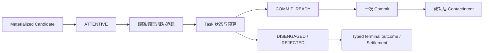

# FCF V1 Encounter Conversion 机制设计（Design-only）

Encounter Conversion 处理的是“Candidate 已经成立后，它如何与当前
presentation 互动”。它不是第二次 Entry，也不是 Contact/Hook 的替代品。

## 0. 快速阅读

**概念**：Encounter Conversion 是 Candidate 成立后的确定性互动状态机，负责把
presentation event 转换为任务状态，直到 `COMMIT_READY`、拒绝或脱离。

**整体机制**：只读取 Candidate/Species/Program/Presentation snapshot；task
capability gate 处理真正不可执行，soft difficulty 留在 task budget；到达
`COMMIT_READY` 后只产生 typed outcome，只有 Commit 成功才生成 ContactIntent。

**配置方式**：配置 motive-specific state graph、event predicate、task profile、
capability requirement、timeout/terminal outcome 和 revision；禁止隐藏随机 transition。

**中文机制描述**：鱼已经进入遭遇后，系统按动作和事件一步步推进“关注、跟随、
追逐、拦截”；这段过程不重新抽鱼，也不能绕过 Commit 直接接触。



## 1. 前置条件

Conversion 只能接收：

```text
materialized Candidate
+ atomic reservation snapshot
+ immutable presentation/event sequence
+ Species capability snapshot
  + BehaviorProgram task policy snapshot
```

没有 Candidate、没有 reservation 或只存在 Pending proposal 时，不得执行
Encounter AI、task roll 或 Contact intent。

## 2. 输入/输出边界

### 输入

```text
EncounterInput {
  candidate_snapshot
  presentation_truth
  world_fact_snapshot
  task_budget_profile_output
  elapsed_event_time
  history_snapshot
}
```

### 输出

```text
EncounterOutcome {
  state = APPROACH | INSPECT | COMMIT_READY | DISENGAGE | EXPIRED
  task_results[]
  contact_intent?       # populated only by downstream Commit success
  history_delta?
  owner_ids
  input_revisions
}
```

Conversion 只输出 typed task result 或 `COMMIT_READY` outcome；它不扣 PSU、不改变
Species capability、不重新生成 Opportunity，也不直接执行 Hook/Settlement。

## 3. 确定性状态机

```text
APPROACH
  → INSPECT       presentation/event 满足 inspect predicate
  → DISENGAGE     hard task impossible 或 policy 明确放弃
  → COMMIT_READY  task predicate 满足且 candidate 仍有效

INSPECT
  → APPROACH      cue/event 改变但仍可继续
  → DISENGAGE     soft task 结果不足以继续
  → COMMIT_READY  commit predicate 满足

COMMIT_READY
  → emits typed COMMIT_READY outcome only
  → Commit (one decision)
  → ContactIntent only if Commit succeeds
  → CONTACT/HOOK downstream
```

相同 Candidate snapshot 与相同 Presentation Event sequence 必须得到完全相同
的状态与输出。状态转换只在语义事件边界执行，不得每帧重新随机决定。

## 4. Hard vs soft task

### Hard impossible

只有真正无法执行的 capability/geometry 条件允许在 Conversion 前阻断：

```text
task_capability_gate(...) → ACTIONABLE | BLOCKED
```

`BLOCKED` 必须记录 task、capability、consequence_id、owner、stage、revision
和 reason；不能伪装成较低的 Entry/E。

### Soft difficulty

距离、角度、流速、温度、DO、presentation 质量等软因素只产生可观察的
task output，例如：

```text
task_result {
  pursuit_duration_s
  burst_budget_remaining
  orientation_error_deg
  confidence_band
  consequence_id
}
```

软难度不能在 Conversion 中变成一次新的 Entry roll；也不能在多个 profile
重复消费同一个 physical consequence。

## 5. Task-budget profile

按照环境组合设计，所有温度/DO/流速/深度对当前 task 的影响由一个声明的
`task_budget_profile` 一次性消费：

```text
budget = task_budget_profile(
  canonical_facts,
  task_id,
  capability_snapshot,
  history_snapshot
)
```

profile 必须声明单位、边界、缺失策略、组合算子和 consequence_id。输出被
Candidate snapshot 固定；后续环境变化不能偷偷重算已成立的 task budget。

## 6. Commit / Contact / Hook 分离

```text
Encounter Conversion
  → COMMIT_READY
  → Commit (one declared decision)
  → ContactIntent
  → Contact arbitration
  → Hook compatibility
  → Settlement
```

- Conversion：任务与状态变化；
- Commit：一次是否提交的明确随机边界；
- Contact：容量、时间、几何竞争；
- Hook：嘴部/几何/rig/timing compatibility；
- Settlement：唯一 terminal transaction。

Conversion 不得直接调用 Contact arbitration、生成 ContactIntent 或重复
Commit。只有 Commit 成功的下游步骤才能生成一个 ContactIntent；该 intent
必须带 stable semantic intent ID，抽象 tie 才可确定性裁决。

## 7. 随机性与 replay

V1 Conversion 默认完全确定性。随机性只允许在：

- Commit 的一次 seed-derived decision；
- 明确声明的下游 Contact tie-break（稳定 hash）。

同一 Candidate ID 重试 Conversion 必须返回相同状态；候选被 settle 后，任何
后续转换请求必须返回 terminal/expired，而不能重新打开 Encounter。

## 8. History delta

Conversion 可以产生 typed `HistoryDelta`，但只交给 History/Future owner 在
END-CUT 应用：

```text
task outcome
→ one cause_id
→ one HistoryDelta
→ transaction_id idempotent apply
```

它不能即时修改 satiation、wariness 或 recovery debt，也不能让 task owner
直接持久化历史。

## 9. 编辑器

编辑器必须提供：

1. State graph：状态、predicate、允许的边和 terminal 条件；
2. Capability panel：task envelope、hard gate、soft difficulty 输入；
3. Task-budget panel：canonical facts、单位、边界、组合算子、consequence_id；
4. Event sequence preview：同一 snapshot 重放得到相同状态；
5. Commit/Contact/Hook boundary view：显示下游 owner；
6. History delta panel：cause_id、transaction_id、END-CUT 应用契约；
7. Explain trace：每次转换的输入 revision、输出、owner 和 block reason。

编辑器禁止把软难度自动改写成 Entry penalty，禁止给状态图添加未声明的
随机边，禁止让 Variant 扩展 Species task capability。

## 10. 关键反例

1. Pending proposal 运行 Encounter AI；禁止。
2. 同一 Candidate 每帧重新 roll “是否追击”；禁止，必须事件驱动且确定性。
3. 流速/DO 已进入 task budget，又在 Conversion 另扣同一 endurance；禁止。
4. Hard actionability 失败被实现成低 E；禁止，必须 capability gate BLOCKED。
5. Conversion 直接执行 Hook、Settlement 或生成 ContactIntent；禁止。Conversion
   只能输出 typed outcome，只有下游 Commit 成功后才生成 ContactIntent。
6. settle 后重试转换重新产生 Contact；禁止，terminal state 只读。
7. 两条 task path 写入同一个 HistoryDelta；必须由 History owner 合并且 transaction 幂等。

## 11. 最小闭合结论

```text
Candidate snapshot
→ deterministic task state machine
→ one Commit boundary
→ ContactIntent
→ downstream Contact/Hook/Settlement
```

Encounter Conversion 在 task profile、状态边、随机边界和 History delta
owner 未闭合前，不应实现成一个自由组合的 fish AI 状态树。
