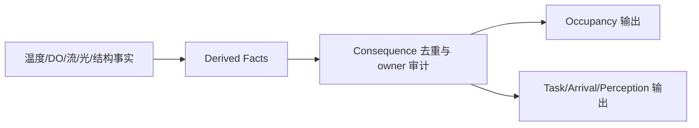

# FCF V1 环境因子组合设计（Design-only）

本文件解决一个比单因子公式更容易出错的问题：温度、DO、流速、深度
分别看都合理，但组合后可能对同一个物理后果重复扣减。V1 采用“事实先
合并、后果再分 owner”的顺序。

## 0. 快速阅读

**概念**：环境组合不是把多个 multiplier 相乘，而是把 canonical facts 映射为
不重复的 physical consequences。

**整体机制**：温度、DO、流、光学、深度等事实并行进入 consequence mapping；
每个 consequence 绑定唯一 owner，再按明确 profile 生成 Occupancy 或 Task 等输出。

**配置方式**：配置 fact/profile reference、单位、范围、UNKNOWN 策略、
`consequence_id`、owner 和 downstream stage；禁止没有 owner 的总分公式。

**中文机制描述**：先确认多个环境事实是否描述同一个物理原因，再决定由谁结算；
同一个后果只扣一次，不因“因子更多”就自动变成更难咬。



## 1. 三层对象不可混淆

```text
Raw observation        传感器/模型原始观测
Canonical World Fact   校准后的物理事实 snapshot
Semantic consequence   对某个阶段有意义的物理后果
```

例如“高温使 DO 饱和度变化”可以在数据校准层发生；这不自动意味着高温
和低 DO 各自都能在 Entry/Conversion 再扣一次。

## 2. 因果图的唯一方向

```text
observations
  → canonical facts (T, O₂, flow, depth, light, ...)
  → local derived facts (thermal band, oxygen band, current load)
  → one named physical consequence
  → one authoritative owner
  → downstream stage
```

Derived fact 可以组合多个环境输入，但必须声明其输入和唯一 consequence。
禁止从同一个 derived fact 再生成多个同义的 penalty。

## 3. Owner 矩阵

| 物理后果 | 允许 owner | 下游 | 禁止的第二次表达 |
|---|---|---|---|
| 节点长期适居性 | Occupancy | Population allocation | Entry/E 再扣“鱼不在” |
| 当前爆发/耐力预算 | Encounter Conversion task profile | pursuit/burst/recovery | Occupancy 再扣同一体能后果 |
| 明确致死风险 | Safety/Lifecycle | block enter / declared transition | Occupancy 迁移 + Safety 再迁移 |
| 几何遮挡/可达性 | Program/Lifecycle（semantic owner） | Perception consumes A | T/E 再扣同一距离后果 |
| 到达时机 | Arrival/T | Opportunity timing | Occupancy 再扣同一到达延迟 |
| 资源消耗/恢复债务 | History/Future | END-CUT state | Conversion 再扣同一历史变化 |

一个 factor 可以影响多个 owner，前提是它产生的是可区分的物理后果：
例如温度同时影响长期分布和已在场鱼的爆发预算；这不是同一个“鱼不想
靠近”后果。trace 必须分别列出 consequence_id。

## 4. 组合顺序

### 4.1 数据层组合

温度、盐度、压力可以参与 DO 的测量校准；校准后只产生一个
`DissolvedOxygenFact`。校准输入不再作为独立行为 penalty 下发。

### 4.2 Occupancy 层组合

对每个 node × slice，只有在每个权重都来自独立、已命名的长期适居
consequence profile 时，才允许组合：

```text
w_node = base_occupancy
         × w_thermal
         × w_oxygen
         × w_current
```

每个 `w_*` 必须声明 profile_id、输入单位、闭区间边界、UNKNOWN 行为和
consequence_id，输出为 `[0,1]` 无量纲长期权重。若两个权重表达同一
后果（例如温度和 DO 都只是“代谢压力”），必须先合并为一个 profile，
不能双乘。关键 occupancy fact 为 UNKNOWN 时，V1 不向该 node 新增质量，
保留已有 slice，并在 trace 写入原因。allocator 统一负责归一化、cap 和
PSU conservation。

### 4.3 Conversion 层组合

```text
task_budget = task_budget_profile(
  canonical_facts={temperature, DO, flow, depth}, task_id, acclimation/history
)
```

V1 由一个声明的 `task_budget_profile` 一次性消费各 canonical fact，输出
带单位的 budget、duration 或 recovery debt，并声明输入字段、边界、缺失
策略和 consequence_id。不能把 occupancy 权重带入 Conversion，也不能让
task profile 改写 Opportunity 或 source PSU；默认不允许用链式乘法实现。

### 4.4 Safety 层优先级

```text
DEFINITE lethal fact
  > HYPOXIA_RISK / thermal-risk safety block
  > normal occupancy/policy evaluation
```

Safety block 是运行时禁止新进入的唯一 owner。它不追溯销毁 Candidate，
也不自动产生第二个 migration/settlement；后续迁移必须由 Lifecycle contract
明确接管。

## 5. UNKNOWN / 不确定性组合

因子质量状态不能被平均成一个“看起来正常”的数字：

- 任一关键 lethal boundary 不确定 → 对应 Safety 输出 `*_RISK`，阻断新 Entry；
- 只有 Occupancy 事实不确定 → 保守不增加新可用质量，保留已有 slice；
- 只有 task profile 不确定 → 使用声明的保守 performance profile，不改变 PSU；
- `UNKNOWN` 默认不生成新 Candidate，并在 trace 标记具体缺失因子。

不确定性本身不是随机数，也不能通过高频采样提高 Entry 机会。

## 6. 反例推理

1. **温度→代谢、DO→代谢**：若两者最后都表示 burst budget 下降，必须合并
   为一个 task profile owner；只有可区分的耐力/恢复后果才可拆分。
2. **深度→低 DO→鱼离开**：深度只是定位输入，低 DO 的 safety/occupancy
   owner 负责后果；不能深度先扣 A、DO 再扣 E。
3. **流速→补氧→耐力**：若补氧变化已体现在 canonical DO，流速不能再扣
   同一个 exertion penalty；若流速另有水动力阻力，则必须声明不同 task consequence。
4. **一个因子跨阶段**：温度影响 occupancy 和 task performance 可以成立，
   但必须展示两个 consequence_id，不得都命名为 `thermal_stress`。
5. **安全与预分配竞争**：Occupancy 零权重不能触发迁移；Safety/Lifecycle
   才能阻断运行时进入或执行声明迁移。

## 7. 编辑器要求

环境组合编辑器不允许只显示最终 multiplier，必须显示一张可审计图：

```text
fact inputs → derived fact → consequence_id → owner → stage
```

保存时检查：

- consequence_id 唯一 owner；
- derived fact 的输入 revision 完整；
- 同一输入未连接到同义 consequence；
- safety edge 优先级高于 normal occupancy；
- 组合函数的单位和范围可验证；
- 任何新增交互都生成 review diff，而不是静默改变旧 profile。

## 8. 最小闭合结论

环境因子组合不是“把更多数相乘”，而是：

```text
canonical facts
→ distinct physical consequences
→ one owner per consequence
→ deterministic downstream effect
```

在 owner 图和反例未闭合前，不应实现跨因子的总 multiplier。
