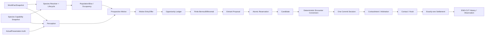
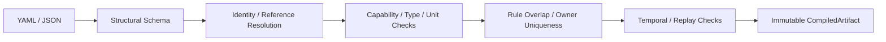
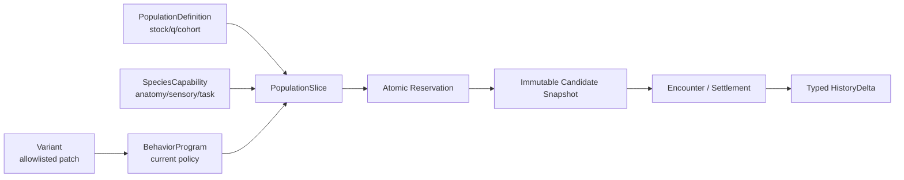
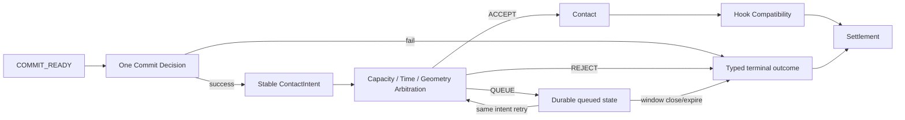
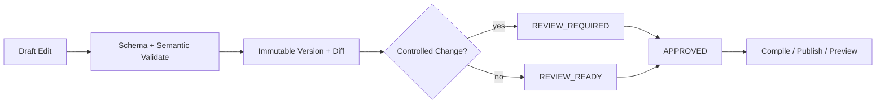

# FCF V1 / RC4 工程实现规格

状态：**V1 Freeze Candidate — RC4**  
权威来源：Notion 中的 RC4 Review Target 及其 adjudication patch。本文是工程实现
伴随规格；若本文与当前 RC4 权威文档冲突，以 RC4 为准。

## 0. 阅读指南

本文回答工程师最关心的五个问题：

1. 运行时各阶段按什么顺序执行？
2. DSL 可以配置什么、必须拒绝什么？
3. 鱼群质量、Candidate 和 History 如何建模？
4. replay、并发和终结结算如何保证唯一？
5. 生产 runtime/storage 接入需要满足哪些验收条件？

先记住六条不可破坏的不变量：

| 不变量 | 工程含义 |
|---|---|
| World Fact 与鱼类解释分离 | 环境数据不能携带 `GOOD_FOR_BASS` 等结论 |
| Species = capability | 当前策略属于 Program，Variant 只能覆盖 allowlist policy |
| Candidate 在 reservation 后才存在 | Pending 不占 PSU、不运行 AI |
| 一个后果只有一个 owner | 禁止 Occupancy、Entry、Conversion 重复惩罚 |
| 随机性只在声明边界 | Motive/Encounter 默认确定性；Entry/Commit 使用稳定 identity |
| 所有终结写入幂等 | Reservation、Settlement、HistoryDelta 可安全重放 |

## 1. 运行时契约

### 1.1 总体因果链

运行时以 `causal cut` 为评价单位。一次 cut 内所有 resolver 必须读取相同的
World/History/Geometry/Policy revision snapshot。



每个阶段必须返回 typed result，并包含输入 revision、输出、owner、
`consequence_id` 和失败原因。任何阶段不得静默消费另一个阶段拥有的值。

### 1.2 一次 cut 的执行顺序

```text
pin causal-cut revisions
→ resolve World Facts / Geometry / History
→ resolve Species capability + Slice/Program policy
→ allocate Occupancy
→ compile ActualPresentation cues
→ compute Perception A + Hard Actionability
→ resolve one Prospective Motive
→ resolve one motive-specific EntryOffer E
→ consume one stable Opportunity
→ realize finite entrant proposals
→ reserve source q atomically
→ materialize Candidate
→ run deterministic Encounter Conversion
→ perform at most one Commit decision
→ arbitrate Contact and evaluate Hook
→ settle Candidate exactly once
→ apply typed HistoryDelta at END-CUT
```

## 2. DSL：声明式 authoring surface

### 2.1 DSL 能表达什么

FCF DSL 使用 YAML/JSON，描述：

- World Fact/Profile 的版本化引用；
- PopulationDefinition 与有限质量尺度；
- Species capability；
- PopulationSlice 与 Lifecycle policy；
- BehaviorProgram、Motive、EntryOffer 和 trigger；
- Variant 的 allowlist policy override；
- resolver rule、`consequence_id` 和 owner；
- trace contract 与明确的 ARRIVAL placement。

DSL 不允许任意脚本、循环、隐藏随机数或 raw `Fish × Item` terminal coefficient。
canonical Schema 见
[`fcf_v1.schema.json`](../schemas/fcf_v1.schema.json)。温度 Profile 使用独立的
[`temperature_profile.schema.json`](../schemas/temperature_profile.schema.json)。

### 2.2 顶层 namespace

```text
schema_version
world_facts
population_definitions
species
population_slices
programs
variants
settlement_owners
resolver_rules
trace_contract
arrival
```

未知 root/nested field 一律 fail closed。namespace 只有在 artifact 确实不使用时
才能省略，不能由 runtime 猜默认值。

### 2.3 Canonical 配置示例

```yaml
schema_version: fcf.v1

population_definitions:
  - id: bass_stock
    q: 10
    cohort_axes: [age_class]
    history_scope: SLICE
    population_revision: bass_stock:r3

species:
  id: bass
  population_definition_id: bass_stock
  anatomy_profile: perciform_mouth_v2
  sensory_channels: [visual, vibration]
  allowed_contacts: [BITE_REMOVE, SLASH, NIBBLE]
  history_schema: bass_history_v1
  capability_limits:
    tasks: [SHORT_BURST_INTERCEPT, DEFENSE_LUNGE, STATION_HOLDING]
    max_defendable_distance_m: 18

population_slices:
  - id: bass_spawn_guard
    population_id: bass_stock
    cohort_key: mature
    lifecycle_role_key: SPAWN_GUARD
    behavior_program_id: bass_spawn_guard_v1
    minimum_hold_s: 30
    hysteresis_policy_id: spawn_guard_hysteresis:r2

programs:
  - id: bass_spawn_guard_v1
    slice_role: SPAWN_GUARD
    motive_priority: [DEFEND, INVESTIGATE, NONE]
    tasks: [DEFENSE_LUNGE]
    contact_types: [BITE_REMOVE, SLASH]
    occupancy:
      - node_tag: SPAWN_SITE
        grade: PRIME
    entry_offers:
      DEFEND:
        base: NORMAL
        rules:
          - {when: nest_intrusion_onset, add: STRONG}
    reevaluation_triggers: [NEST_INTRUSION_ONSET]
    trigger_policies:
      NEST_INTRUSION_ONSET: {debounce_s: 2, hysteresis: true}

settlement_owners:
  - {physical_consequence_id: nest_intrusion_motive, owner: MOTIVE}

trace_contract:
  version: trace:v1
  required_stages: [PERCEPTION, MOTIVE, ENTRY, RESERVATION, SETTLEMENT]
  include_inputs: true
  include_revisions: true
```

示例刻意不把 lethal/safety 条件写入 `EntryOffer.deny`。致死或风险判定必须由
独立的 Lifecycle/Safety gate 在 Entry/Reservation 前执行。当前 canonical DSL
尚未定义通用 `capability_relation` predicate；在正式扩展 schema/compiler 之前，
不得用未知 predicate 字段伪装成可执行配置。具体温度/DO safety contract 由对应
Profile compiler 和 typed runtime resolver 提供。

### 2.4 编译流程



任一 semantic error 都必须阻止编译。输出必须包含完整 flattened artifact、版本、
source paths、diagnostics 和 canonical diff。

### 2.5 必须拒绝的配置

- 未知 schema/version/字段、重复 ID、非有限或非正 `q`；
- Program 引用 Species 未声明的 task/contact/sensory capability；
- 同优先级、谓词可能同时为真且 effective interval 相交的 resolver rules；
- fish-specific World Fact，例如 `COLD_SLOW`、`GOOD_FOR_BASS`；
- 写入最终咬口系数，而不是声明 Cause Role/typed output 的规则；
- 同一 `physical_consequence_id` 拥有两个 owner；
- 缺少 stable trigger ID、debounce 或 hysteresis 的 reevaluation；
- ARRIVAL 同时生产新 eligible units，又为同一事实应用第二个 `T < 1`；
- 将 Program 写入 `population_slice_key`；
- Variant 修改 q、population identity、anatomy、sensory/contact/task capability、
  History schema 或 settlement owner。

## 3. 实体与质量模型

### 3.1 对象分层



| 属性组 | 例子 | 权威 owner | Candidate 期间是否可变 |
|---|---|---|---|
| Population scale | `population_id`, `q`, cohort axes | PopulationDefinition | 否 |
| Species capability | anatomy、sensory channels、contact/task envelope | Species | 否；snapshot |
| Slice/Lifecycle | lifecycle role、minimum hold、hysteresis | Lifecycle | 只能通过 transaction 转换 |
| Current policy | motive priority、occupancy、EntryOffer、trigger | BehaviorProgram | 否；materialize 时 snapshot |
| Presentation truth | silhouette、flash、vibration、speed、geometry | ActualPresentation compiler | 否；event snapshot |
| State/History | satiation、wariness、recovery debt | History/Future | 仅 END-CUT 更新 |

### 3.2 PopulationSlice

```text
population_slice_key = (population_id, cohort_key, lifecycle_role_key)
```

该 key 必须跨 resolver、storage row 和阈值抖动保持稳定。Program 是 policy，
不属于 identity。`LifecycleCommitment` 拥有 entry time、minimum hold、hysteresis
和 exit eligibility。

Slice transition 只能在一个 transaction 内转移 PSU：

```text
from_slice.ActualSupplyPSU -= delta
to_slice.ActualSupplyPSU   += delta
```

它不得创建或销毁 stock。同一 transition ID 重放必须返回原结果；不同 payload
复用同一 ID 必须 conflict。

### 3.3 PopulationSource 与有限质量

每个 `PopulationSource` 只属于一个 Slice，并持有：

```text
ActualSupplyPSU
ReservePSU
EncounterHoldPSU
RecoveryHoldPSU
RemovedStockPSU
q
```

守恒关系分为 active 与 audit 两种口径：

```text
ActiveStockPSU = Σ ActualSupply + Reserve + EncounterHold + RecoveryHold
AuditTotalPSU  = ActiveStockPSU + RemovedStockPSU
```

除显式 `REMOVE_STOCK` 外，`ActiveStockPSU` 不变；任何情况下 `AuditTotalPSU`
必须守恒。

有限单位与入口概率：

```text
U = floor(ActualSupplyPSU / q)
π = clamp(A × T × E, 0, 1)
K ~ Binomial(U_eligible, π)
```

- 不允许跨 source 拼接 q；
- 不允许以 Poisson + cap 替换 Binomial；
- `A/T/E` 必须各自有明确语义 owner。

### 3.4 Proposal、Pending 与 Candidate

`EligibleEntrantProposal` 只是统计 token，不修改 ledger。只有 atomic reservation
成功后 Candidate 才存在：

```text
ActualSupply[source] -= q
EncounterHold[source] += q
create Candidate(reservation_id, immutable_snapshot)
```

Pending proposal：

- 占用 0 PSU；
- 不运行鱼 AI/Encounter；
- slot 打开时不重新进行 Entry roll；
- reservation 失败只能重试同一有效 proposal 或过期，不能伪造新 Opportunity。

Candidate 必须 snapshot capability、slice、Program/Variant、World/History/Geometry
revision、presentation truth 与 semantic fingerprint。之后的 authoring 修改不得
追溯改变既有 Candidate。

## 4. Resolver 顺序与 owner

### 4.1 Entry resolver 顺序

对每个 eligible `Slice × Source`：

1. 计算 opportunity delta 和 eligible finite units；
2. 计算 Perception Access `A`；
3. 执行 Hard Actionability Gate，仅拒绝真正不可执行的 task；
4. 确定性解析 Prospective Motive；
5. 解析 motive-specific EntryOffer `E`；
6. 仅在真实 arrival timing 尚未由外部系统结算时计算 `T`；
7. 消费一个 stable Opportunity ID；
8. 实现 finite Bernoulli/Binomial entrant；
9. 创建 proposal；
10. atomic reservation 成功后 materialize Candidate。

### 4.2 A / T / E 语义

| 值 | 语义 | 不能用来表示 |
|---|---|---|
| `A` | presentation 的空间/感官可达性 | 通用环境 bonus、最终 detect success |
| `T` | 尚未被结算的 arrival timing | 第二个 arrival penalty |
| `E` | 已选 motive 是否提出 Encounter 机会 | Species capability、Hook success |

若 ARRIVAL 直接生产新 eligible units，则同一事实的 `T=1`。

### 4.3 Consequence owner matrix

每个 physical consequence 只能有一个 authoritative owner。下表的内部 Cause
Role `A–F` 与概率公式中的 Accessibility `A`、Timing `T`、Entry `E` 不是同一套符号：

| Cause Role | Owner 范围 | 例子 |
|---|---|---|
| A | Program / Lifecycle | 生命周期进入或 Program 选择 |
| B | Occupancy / Population | 温度栖息偏好、DO 长期回避 |
| C | Perception | 光学遮挡产生 `A_visual` |
| D | Motive / Entry | 防守动机与 motive-specific EntryOffer |
| E | Functional / Conversion | 低氧追击成本、流速 task budget |
| F | History / Future | 实际资源消耗、警戒或恢复债务 |

同一 consequence 不得同时在 Entry 和 Conversion 结算。允许一个环境事实产生
多个后果，但必须证明它们物理上不同，并使用不同 `consequence_id`。

## 5. 时间身份、机会与 replay

### 5.1 允许产生 Entry roll 的机会

```text
FIRST_ACCESS
ARRIVAL
SEMANTIC_REEVALUATION（必须在 allowlist）
```

`NEW_SCOPE_AFTER_REENTRY` 只创建新的 scope，不直接产生一次 roll。

### 5.2 Opportunity ID

```text
hash(
  scope_id,
  population_slice_key,
  source_id,
  opportunity_kind,
  trigger_id_or_access_partition,
  source_population_revision_basis
)
```

durable ledger 至少保存：

```text
opportunity_id
semantic_snapshot_fingerprint
revision_basis
eligible_units / consumed_units
simulation_time
result_summary
```

相同 ID + 相同 semantic payload 返回已有结果，不重新 roll；相同 ID + 不同
payload 必须 conflict。运行 tick、帧率或消息重复投递不能进入 identity。

## 6. Encounter、Commit、Contact、Hook 与 Settlement

### 6.1 Encounter Conversion

相同 Candidate snapshot 与 Presentation Event sequence 必须得到相同 Encounter
状态序列。soft task difficulty 保留在 downstream task budget；只有
`HARD_IMPOSSIBLE` 可在 actionability gate 阻断。

```text
Candidate
→ ATTENTIVE / FOLLOWING / THREAT_TRACK / INTERCEPTING ...
→ COMMIT_READY | DISENGAGED | REJECTED
```

`DISENGAGED/REJECTED` 进入 typed terminal outcome；只有 `COMMIT_READY` 允许执行
一次 Commit decision。

### 6.2 Commit、Contact 与 Hook



- 每个 `Candidate × contact_window` 最多一个有效 ContactIntent；
- Contact arbitration 按时间/几何确定排序；抽象 tie 使用 stable tie-break ID；
- QUEUE 是非终结、可持久化状态，不立即释放 Candidate；
- ContactType 必须来自 Species repertoire；
- Hook 只消费 mouth/geometry/rig/timing 等 downstream 输入，不读取上游鱼量或 E。

### 6.3 Exactly-one Settlement

每个 live Candidate 必须拥有：

```text
exactly one reservation
exactly one idempotent terminal settlement transaction
```

terminal reason 映射为：

```text
RETURN
RETURN_WARY
RELOCATE
RECOVERY_HOLD
REMOVE_STOCK
```

reservation 前取消没有 ledger write；reservation 后取消必须把 held q 恰好结算
一次。Encounter/Settlement 只产生 typed outcome；该 outcome 再映射为一个
`HistoryDelta`，并由 History/Future owner 在 END-CUT 应用。

## 7. Editor 契约

Editor 是 schema-driven、transaction-based authoring tool，不是生产运行时调参器。



Editor 必须：

1. 加载 exact schema 和当前 artifact revision；
2. 对 inherited capability/identity/owner 字段显示只读原因；
3. 将 resolver order 和 owner 显示为图/表，而不是隐藏 precedence；
4. 每次 edit 在 trial artifact 上验证，失败不修改 draft；
5. 保存完整 immutable snapshot、canonical diff、author metadata；
6. 对 capability/scale/owner/history schema 变更强制 `REVIEW_REQUIRED`；
7. 使用相同 seed/scope/revision 运行 deterministic preview；
8. 导出 compiled artifact、migration metadata 和 human review report。

Editor 禁止：自动排序/合并同优先级规则、补 owner、补 World Fact 默认值、重置
Opportunity Ledger，或在不触发 recalibration/review 的情况下修改 q。

详见 [Editor Interaction Design](editor_interaction_design.md)。

## 8. 验证契约

reference prototype 必须覆盖：

- finite-unit Binomial semantics；
- conservation 和 randomized property sweep；
- atomic single-owner reservation；
- Pending 零质量、无 AI、不开新 roll；
- settlement rollback 与幂等；
- stable Opportunity/replay/input-rate invariance；
- Slice identity 与 lifecycle transfer；
- A/T/E placement XOR；
- consequence owner uniqueness；
- deterministic Motive/Encounter；
- one-shot Commit、Contact/Hook separation；
- Contact queue/replay/capacity；
- DSL、Variant、TemperatureProfile fail-closed validation；
- journal restart/hydration 和多进程 exactly-once；
- Spawn Bass、Trout Drift、Carp Static Bait flagship traces。

绿色测试是 evidence，不替代语义 Independent Review。当前执行证据见
[Verification Report](verification_report.md)。

### 8.1 Production conformance smoke

生产 runtime factory 必须可以运行：

```python
from fcf_v1 import run_core_conformance

report = run_core_conformance(production_factory)
if not report.passed:
    raise RuntimeError(report.to_json())
```

smoke contract 验证有限入口、Opportunity 不重掷、Candidate 单次结算、settlement
重试幂等和 accounting conservation。完整 CI 仍必须运行 fixture、concurrency 和
property suite。

## 9. Durable Journal Adapter

### 9.1 接口

```python
class JournalAdapter(Protocol):
    def append_once(self, event_id: str, event_type: str, payload: dict) -> bool: ...
    def get(self, event_id: str) -> dict | None: ...
    def records(self) -> list[dict]: ...
```

`append_once` 必须原子地区分：

| 情况 | 结果 |
|---|---|
| 新 ID | append，并返回 `True` |
| 相同 ID + 相同 `event_type` + 相同 payload | 幂等 replay，返回 `False` |
| 相同 ID + 不同 `event_type` 或不同 payload | conflict，拒绝 |

### 9.2 Reference adapters

- `DurableJournal`：fsync JSONL + POSIX inter-process file lock；
- `SQLiteJournal`：unique event key + `BEGIN IMMEDIATE` transaction；
- replicated production log：可以替换实现，但必须保持同一语义。

首次 WAL 初始化可以 bounded retry；不得把临时锁错误转化为第二次语义写入。

### 9.3 事件和启动恢复

Engine 至少持久化：

```text
OPPORTUNITY_CONSUMED
CANDIDATE_RESERVED
CANDIDATE_SETTLED
```

生产实现还必须由相应 owner store 持久化：

```text
Contact arbitration_transaction_id + ACCEPT/REJECT/QUEUE result
History applied_transaction_ids + typed HistoryDelta
Lifecycle transition_id + transfer payload
```

这些记录可以使用独立的 Contact/History/Lifecycle store，不强制写入同一个
`JournalAdapter`；但必须提供相同的 same-ID replay / different-payload conflict
语义，不能只保存在进程内存中。

### 9.4 Recovery manifest、启动基线与 hydration gate

完整 production adapter 必须在 `JournalAdapter` 之外暴露：

```python
class RecoveryJournalAdapter(JournalAdapter, Protocol):
    def recovery_manifest(self) -> dict: ...
```

manifest 的最小字段：

```text
RecoveryManifest {
  manifest_id
  schema_version
  journal_epoch_id
  population_baseline_revision
  source_baseline_hash
  first_event_sequence
}
```

manifest 与对应的 pre-journal source baseline 必须在 journal epoch 接收第一条事件
前持久化；二者要么在同一事务中创建，要么由不可变 deployment manifest 的内容
哈希绑定。每条 production journal record 必须携带同一 `journal_epoch_id` 和单调
sequence，使 baseline 与事件流不可错配。`sequence` 由 journal store 在
append-once 原子事务内分配，不由 caller 提供，也不属于 caller semantic
payload/replay equality。相同 event ID replay 保留首次分配的 sequence；
`append_once` 仍返回 `False`，
调用方需要 sequence 时通过 `get(event_id)` 读取首次记录。manifest 创建或 epoch
切换失败时不得接收写入。

当前 reference `DurableJournal/SQLiteJournal` 只证明 append-once/hydration smoke
语义，不提供上述 manifest/epoch 完整证据；production Freeze gate 必须由
`RecoveryJournalAdapter` 或等价外部 baseline-manifest adapter 补齐并测试。

Production 必须从 **journal 第一条事件之前的 source baseline** 构造 Source/Slice
状态，并以 `hydrate_journal=True` 按顺序重放 journal。hydration 未完成时，必须
拒绝所有可能读取或修改相关 ledger、hold、Candidate、Opportunity、Contact、
Lifecycle 或 History 状态的请求；不能只拒绝被调用方标记为“replay”的请求。

只有 baseline identity/revision/hash 与 `RecoveryManifest` 匹配、event epoch/sequence
连续、全部事件恢复完成、所有 owner store reconciliation 通过后，scheduler 才能
进入 `READY`。禁止：

- 为已有 Opportunity ID 执行新的 Entry draw；
- 为已有 reservation event 再次扣 q；
- 为已 settlement 的 Candidate 再次应用 ledger/History delta。

### 9.5 跨 store crash boundary

Settlement 与它产生的 HistoryDelta，以及跨独立 store 的 Contact/Lifecycle 写入，
必须采用以下二者之一：

1. 同一事务数据库中的原子 transaction；或
2. authoritative write-ahead journal + transactional outbox + restart reconciliation。

Outbox 模式的固定顺序：

```text
1. 用稳定 transaction_id 写入 PREPARED 记录，包含 ledger delta、typed outcome、
   HistoryDelta/Lifecycle/Contact side effects 和目标 owner
2. 原子提交 authoritative settlement/transition result + outbox item
3. 各 owner store 以同一 transaction_id 幂等应用
4. 写 APPLIED acknowledgement
5. 全部必要 acknowledgement 完成后标记 transaction COMPLETE
```

崩溃恢复时先扫描 `PREPARED/COMMITTED but not COMPLETE`，按 stable transaction ID
重投 outbox；owner store 已有相同 payload 时返回幂等成功，不同 payload 时停止并
报告 conflict。不得先把 Settlement 标成 COMPLETE，再依赖一次易失消息写 History；
也不得让 History 成功而 ledger settlement 永远缺失。

## 10. 生产接入验收清单

真实 production runtime/storage 是独立 Freeze gate。Promotion 前必须确认：

1. 每个 causal cut 固定 World/History/Geometry/Policy revisions；
2. production `JournalAdapter` 满足 new/replay/conflict 原子语义；
3. RecoveryManifest/baseline/epoch 校验和 startup hydration 在接收任何相关请求前完成；
4. 两 worker 竞争同一 event ID 时只有一次 append；
5. fixture、replay、concurrency、property suite 在真实 runtime 上运行，不以 mock 代替；
6. conservation sweep 与三条 flagship trace 通过；
7. ExplainTrace 能展示 stage、input revision、output、owner、identity 和 ledger delta；
8. Contact/History/Lifecycle owner stores 的 same-ID replay/conflict 测试通过；
9. 9.5 的 cross-store atomic transaction 或 outbox crash/restart/reconciliation fixture 通过；
10. Independent Narrow Close Review 给出 APPROVE/APPROVE_WITH_MINOR。

任何缺项都阻止 V1 Freeze promotion。更复杂生态、个体鱼 identity 或新 motive 属于
V1.1，不能代替上述 gate。

## 11. 相关文档

- [FCF V1 中文总览](fcf_v1_overview_cn.md)
- [Design Closure Index](design_closure_index.md)
- [DSL Semantic Design](dsl_semantic_design.md)
- [Fish Entity / Variant Design](fish_entity_variant_design.md)
- [Editor Interaction Design](editor_interaction_design.md)
- [Independent Review Checklist](independent_review_checklist.md)
- [Verification Report](verification_report.md)
