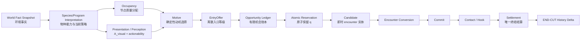
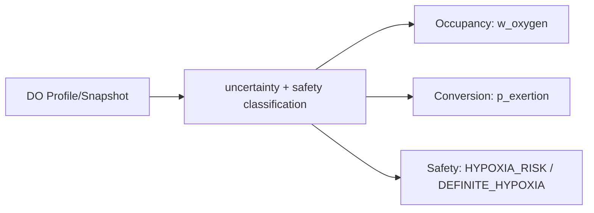
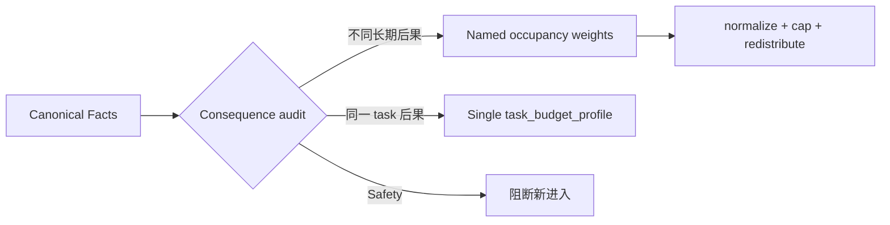
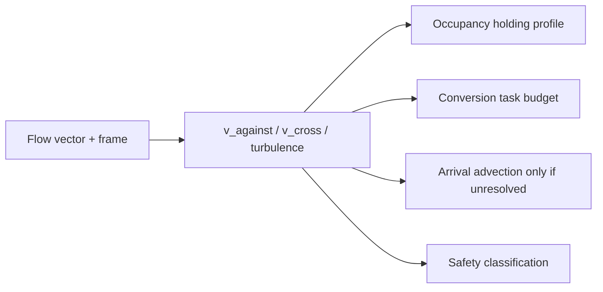
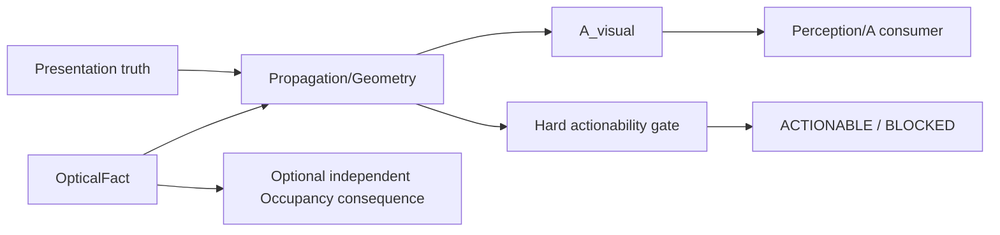
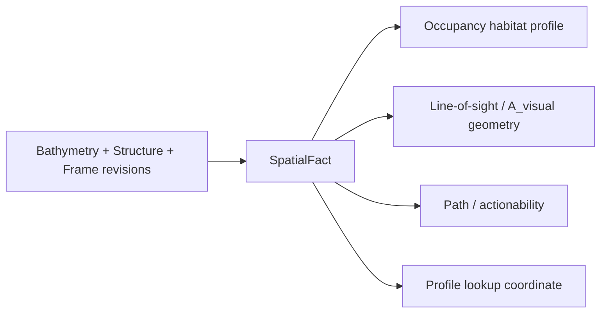
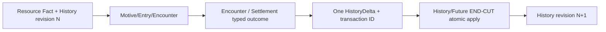

# FCF V1 中文总览

本文是 Fish-Centric Conditional Funnel（FCF）V1 的入口文档，面向产品、
设计、内容和工程人员。它解释“系统在解决什么问题、整体怎么走、在哪里配置”，
不替代各机制的详细 contract。

## 1. 概念描述

FCF 的核心问题不是“给鱼设置一个咬口率”，而是：

> 在有限鱼群质量、真实环境事实和玩家当前 presentation 的共同约束下，
> 可审计地决定哪些鱼有机会进入 encounter，以及这次 encounter 是否能继续。

四个概念必须分开：

| 概念 | 含义 | 例子 |
|---|---|---|
| World Fact | 与鱼无关的环境/物理事实 | 某位置 8m 深度为 16.2°C、DO 为 7.1mg/L |
| Species Capability | 物种能做什么 | 能否视觉感知、能否短距离爆发、允许哪类 Contact |
| BehaviorProgram | 当前 slice 采用的策略 | 防守、觅食、调查的优先顺序 |
| Candidate | 成功保留后正在经历 encounter 的有限质量 | 已从 ActualSupply 转入 EncounterHold 的 q |

Species 是能力，Program 是政策，Variant 是受限政策覆盖；普通鱼默认是
exchangeable mass，不在 V1 中隐式创建持久个体鱼。

## 2. 整体机制：深入但易懂

可以把 FCF 想成一条有闸门的漏斗：

1. **先看世界**：读取固定 causal cut 下的温度、溶氧、流速、光照、结构、资源等事实。
2. **再看鱼能否存在**：Occupancy 根据物种能力和当前 slice policy，把有限质量分配到可停留节点。
3. **再看玩家 presentation**：计算感知可达性 `A_visual`，并运行 Hard actionability gate；只有真正无法执行的 task 才 `BLOCKED`，不改写 `A/E`。
4. **再决定动机**：按 BehaviorProgram 的确定性优先级选择 `FORAGE / DEFEND / INVESTIGATE / NONE`。
5. **再生成机会**：EntryOffer 产生离散等级，有限单位按 Binomial 语义提出 entrant proposal。
6. **最后才保留鱼**：atomic reservation 成功后才创建 Candidate、占用 `q`，并运行 encounter。
7. **继续或结束**：Encounter Conversion → Commit → Contact/Hook → 唯一 Settlement；History 只在 END-CUT 更新。

温度、DO、流速等环境因子不会直接相乘成一个 universal bite multiplier。每个
physical consequence 只有一个 authoritative owner，避免同一原因在 Occupancy、
Entry 和 Conversion 中被重复惩罚。

## 3. 主要链路图示

### 3.1 总体因果链



### 3.2 温度事实链

```mermaid
flowchart LR
  A[传感器/模型/校准样本] --> B[TemperatureProfile]
  B --> C[BakedTemperatureIndex]
  C --> D[causal cut 固定\nprofile + index + algorithm revision]
  D --> E[temperature(location, depth, cut)]
  E --> F[区间分类\nDEFINITE_IN / AMBIGUOUS / LETHAL_RISK / DEFINITE_OUT / UNKNOWN]
  F --> G[Occupancy 或 Task 或 Lifecycle\n各自唯一 owner]
```

#### 3.2.1 温度的完整最小配置

下面的配置不是示意伪字段，而是可以交给 TemperatureProfile structural +
semantic compiler 的最小完整形态：

```yaml
schema_version: fcf.temperature_profile.v1
profile_id: north_lake_minimal
waterbody_id: north_lake
spatial_frame_id: north_lake_grid:r4
profile_mode: SINGLE_LAYER
temperature_unit: CELSIUS

temporal_clock:
  clock_id: lake_sim_clock
  clock_revision: clock:r3
  unit: MILLISECONDS
  epoch: SIMULATION_START

source_policy:
  accepted_source_kinds: [SENSOR]
  maximum_uncertainty_c: 1.0
  freshness_by_source_s: {SENSOR: 900}
  stale_behavior: RETURN_STALE_FACT
  missing_behavior: RETURN_UNKNOWN
  outlier_policy_id: thermal_outlier:r2
  calibration_policy_id: thermal_calibration:r5

interpolation_policy:
  spatial_method: NEAREST_CELL
  maximum_spatial_gap_m: 50
  depth_method: NEAREST_IN_LAYER
  maximum_depth_gap_m: 2
  temporal_method: HOLD_LAST
  maximum_time_gap_s: 600
  thermocline_crossing: BLOCK
  algorithm_revision: thermal_interp:r7

depth_layers:
  - layer_id: whole_water_column
    depth_min_m: 0
    depth_max_m: 12
    location_cell_group_id: north_basin_cells
    samples:
      - sample_id: sensor_a_000184
        location_cell: cell_n17
        depth_m: 8
        observed_at_ms: 3600000
        valid_from_ms: 3600000
        valid_to_ms: 4200000
        value_c: 16.2
        uncertainty_c: 0.4
        source_kind: SENSOR
        source_revision: sensor_a:r18
        quality: DIRECT
        calibration_revision: thermal_calibration:r5
        source_sample_ids: [sensor_a_raw_000184]

thermocline_boundaries: []
profile_revision: temperature_profile:r12
source_manifest_hash: sha256:0123456789abcdef0123456789abcdef0123456789abcdef0123456789abcdef
authoring_metadata:
  author: environment_team
  created_at: "2026-08-31T10:00:00+08:00"
  change_reason: minimal single-layer profile
  evidence_refs: [sensor_campaign_2026_08]
```

完整多层/热跃层配置表见
[TemperatureProfile 完整配置](temperature_profile_configuration.md)，机器结构见
[`temperature_profile.schema.json`](../schemas/temperature_profile.schema.json)。

#### 3.2.2 温度的具体查询和判断规则

```text
输入：location=cell_n17, depth=8m,
      cut=(temperature_profile:r12,index:i4,thermal_interp:r7,time=3,900,000ms)

1. 固定三个 revision；任一不可解析 → UNKNOWN
2. 找到包含 8m 的 half-open depth layer
3. 禁止跨 thermocline；检查 spatial/depth/time gap
4. 按配置的算法取值，得到 T=16.2°C, u=0.4°C
5. 形成区间 I=[T-u,T+u]=[15.8,16.6]
6. I 全在 lethal 致死侧 → DEFINITE_OUT
   I 与 lethal 区相交 → LETHAL_RISK
   否则若 I 与 stress/preferred 边界相交 → AMBIGUOUS
   否则 → DEFINITE_IN（具体 occupancy/task 仍由各 profile 计算）
   数据缺失/过期策略为 RETURN_UNKNOWN/uncertainty 超限 → UNKNOWN
7. 只有完成分类后，才分别计算 occupancy/task/lifecycle 输出
```

温度不直接修改 `A` 或 `E`。同一温度后果不能既降低 Occupancy，又以“冷”
再次降低 EntryOffer。更详细判断表见
[温度机制设计](temperature_mechanism_design.md)。

### 3.3 溶解氧（DO）

#### 配置对象

| 层 | 关键字段 | 谁可编辑 |
|---|---|---|
| `DissolvedOxygenFact/Profile` | `value_mg_l`, depth/location/time, uncertainty, quality, source revision | World Fact/Data |
| `OxygenCapability` | `lethal_min`, `stress_min`, `preferred_min`, recovery/exertion profiles | Species capability |
| `OxygenPolicy` | `avoidance_threshold`, hysteresis, minimum hold, task profile | Program/Slice policy |
| `OxygenHistory` | exposure integral, recent minimum, recovery debt | END-CUT History owner |

#### 具体规则

```text
occupancy_band(O; O_avoid, O_pref) =
  0                               O <= O_avoid
  (O-O_avoid)/(O_pref-O_avoid)    O_avoid < O < O_pref
  1                               O >= O_pref

w_oxygen = occupancy_band(O_local, O_avoid, O_pref)
p_exertion = exertion_profile(O_local, recovery_debt, task_id)
```

`lethal_min` 只属于 acute safety，不进入 occupancy 公式。测量区间与 lethal
区域相交时输出 `HYPOXIA_RISK`，阻断新 Entry/Reservation/lifecycle enter；
`UNKNOWN` 不向节点新增 Occupancy 质量、不生成 Candidate，并保持既有 Slice。
完整配置和反例见 [DO 机制设计](dissolved_oxygen_mechanism_design.md)。



### 3.4 环境因子组合

#### 配置对象

每个组合项必须声明：`fact/profile reference`、输入单位、输出范围、
`UNKNOWN` 行为、`consequence_id`、owner、downstream stage。缺少任一项即编译失败。

#### 具体规则

只有对应不同长期栖息后果的权重才允许组合：

```text
w_node = base_occupancy × w_thermal × w_oxygen × w_current
```

如果温度与 DO 最终都表达“同一个代谢压力”，必须先合并成一个 consequence
profile，不能双乘。Conversion 不复用 occupancy 权重，而是一次性调用：

```text
task_budget = task_budget_profile(
  canonical_facts={temperature, DO, flow, depth},
  task_id,
  acclimation/history
)
```

优先级固定为：`DEFINITE lethal > safety risk > normal occupancy/policy`。完整 owner
矩阵见 [环境因子组合设计](environment_factor_composition_design.md)。



### 3.5 流速 / 流向

#### 配置对象

| 层 | 关键字段 |
|---|---|
| `FlowFact` | velocity vector、turbulence、canonical frame、direction uncertainty、depth/location/revision |
| `FlowCapability` | station-holding、swim/burst envelope、rheotaxis capability、preferred current min/max |
| `FlowPolicy` | avoidance threshold、holding/task/arrival profile |

#### 具体规则

```text
v_against = max(0, dot(velocity_vector, local_upstream_axis))
v_cross   = |velocity_vector - projected_parallel_component|
w_flow    = holding_profile(v_against, v_cross,
                            avoidance_threshold, preferred_range)
task_budget = task_budget_profile(  # single authoritative call
  canonical_facts={temperature, DO, flow, depth}, task_id, fatigue_history
)
arrival_time = advection_model(path, flow, cast_motion)  # 仅未被运动系统结算时
```

`holding_profile` 一次解释逆流和横流，不得再乘隐藏 cross-current penalty。
上式中的 flow/turbulence 只是统一 `task_budget_profile` 的输入切片，不能再叠加
第二个独立 flow budget。
`FLOW_RISK/UNKNOWN` 阻断新增，不追溯销毁 Candidate。详见
[流速/流向机制](flow_mechanism_design.md)。



### 3.6 光照 / 浑浊度

#### 配置对象

| 层 | 关键字段 |
|---|---|
| `OpticalFact` | illumination lux、turbidity NTU、spectral band、attenuation、depth/revision |
| Presentation truth | silhouette、flash、motion salience、range、geometry |
| Species capability | visual/spectral/motion sensory channels |
| Profiles | perception profile、可选且独立的 light habitat profile、actionability requirements |

#### 具体规则

```text
A_visual = perception_profile(
  range_m, contrast_ratio, motion_salience,
  spectral_match, fish_sensory_channels
)

w_light = light_habitat_profile(optical_fact, slice_policy)  # 独立 consequence 时才有
actionable = capability_gate(presentation_truth, task_capability)
```

`A_visual` 是 Perception/A 输出，不是 E；actionability 只输出
`ACTIONABLE/BLOCKED`，不修改 A/E。视觉为零时，振动通道仍可能产生 motive。
详见 [光照/浑浊度机制](light_turbidity_mechanism_design.md)。



### 3.7 深度 / 结构

#### 配置对象

| 层 | 关键字段 |
|---|---|
| `SpatialFact` | node ID、bathymetry、geometry/mesh revision、cover、navigable volume、coordinate frame |
| Species capability | depth envelope、body/pass-width envelope、task/path capability |
| Slice policy | habitat/cover preference、path/arrival policy |

#### 具体规则

```text
w_structure = habitat_profile(depth, cover, navigable_volume, slice_policy)
visibility_geometry = line_of_sight(structure_geometry, presentation_path)
actionable = capability_gate(approach_volume, task_envelope)
```

深度首先是温度/DO/流 Profile 的查询坐标，不是自动 penalty。cover volume、
occlusion surface、passage width、current boundary 是不同物理后果，必须分别
登记 owner。详见 [深度/结构机制](depth_structure_mechanism_design.md)。



### 3.8 资源 / 历史

#### 配置对象

| 层 | 关键字段 |
|---|---|
| World resource fact | food availability、competition、disturbance、resource revision |
| History schema | satiation、energy、wariness、recovery debt、范围/初值/revision |
| Delta contract | typed fields、cause ID、owner、transaction ID、merge policy |
| Program rules | History/resource predicates 对 Motive/EntryOffer 的一次性消费位置 |

#### 具体规则

```text
cut start: pin History revision N
→ deterministic Motive / Entry / Encounter
→ Encounter/Settlement emits typed outcome
→ outcome maps to one HistoryDelta
→ END-CUT apply if revision still N
→ persist transaction_id in applied_transaction_ids
→ revision N+1
```

同一 `transaction_id + same delta` 是幂等 replay；同 ID 不同 delta 是 conflict。
Candidate 不直接写 History，本 cut 新历史也不反向改变它。详见
[资源/历史机制](resource_history_mechanism_design.md)。



### 3.9 编辑到运行时

```text
编辑 Draft
  → schema + semantic validation
  → immutable version + diff
  → reviewer approval（受控变更强制）
  → compile / flatten Variant
  → causal-cut runtime
  → ExplainTrace
```

## 4. 配置方式

FCF 使用声明式 YAML/JSON。配置描述能力、slice、策略、事实绑定、规则和 owner，
不允许写任意脚本或隐藏随机逻辑。

### 4.1 最小示例

```yaml
schema_version: fcf.v1

population_definitions:
  - id: bass_stock
    q: 10
    history_scope: SLICE

species:
  id: bass
  population_definition_id: bass_stock
  anatomy_profile: perciform_mouth_v2
  sensory_channels: [visual, vibration]
  allowed_contacts: [BITE_REMOVE, SLASH]
  history_schema: bass_history_v1
  capability_limits:
    tasks: [SHORT_BURST_INTERCEPT, DEFENSE_LUNGE]

population_slices:
  - id: bass_guard
    population_id: bass_stock
    cohort_key: mature
    lifecycle_role_key: SPAWN_GUARD
    behavior_program_id: guard_program

programs:
  - id: guard_program
    slice_role: SPAWN_GUARD
    motive_priority: [DEFEND, INVESTIGATE, NONE]
    entry_offers:
      DEFEND: {base: NORMAL}

settlement_owners:
  - {physical_consequence_id: nest_intrusion, owner: MOTIVE}
```

配置原则：

- `PopulationDefinition.q` 定义有限质量单位；
- `Species` 只声明 capability；
- `PopulationSlice` 绑定 cohort/lifecycle 和 Program；
- `Program` 选择策略，不创建鱼、不修改 capability；
- `Variant` 只能覆盖 allowlist 内的 policy；
- 每个 consequence 必须声明唯一 owner；
- 未知字段、未解析引用、同优先级可重叠规则直接编译失败。

### 4.2 环境数据配置

环境数据在 `World Fact`/Profile 面板配置：来源、单位、位置、深度、时间、质量、
不确定性和 revision。它不能写成 `GOOD_FOR_BASS` 或 `bite_multiplier`。

## 5. 机制中文描述

| 英文 | 中文工作术语 | 一句话解释 |
|---|---|---|
| Occupancy | 栖息占位 | 有限鱼群质量长期分布到哪些节点 |
| Perception Access | 感知可达性 | presentation 是否能被鱼接收 |
| Motive | 当前动机 | 这条策略此刻为何开始接近 |
| EntryOffer | 进入机会等级 | 是否提出进入 encounter 的机会 |
| Opportunity Ledger | 机会账本 | 防止同一物理机会被重复抽取 |
| Reservation | 原子保留 | 成功后才把 q 从实际供给移入 encounter hold |
| Candidate | encounter 候选 | 已保留、可继续运行 encounter 的质量实体 |
| Encounter Conversion | 遭遇转化 | 将动作序列确定性地推进到 Commit 边界 |
| Commit | 承诺判定 | 一次明确的随机决策，不重复重掷 |
| Contact / Hook | 接触 / 挂钩 | 依据下游几何、口型、时序判断接触结果 |
| Settlement | 终结结算 | 唯一一次归还、警戒、迁移、恢复或移除 |
| END-CUT History | 结算末历史更新 | 统一应用饱食、警戒、恢复等 typed delta |

## 6. 设计边界

V1 已冻结的边界包括：有限质量守恒、atomic reservation、Candidate 快照、
确定性 Motive/Encounter、A/T/E owner 分离、UNKNOWN 保守处理、唯一 settlement
owner、可持久化 replay identity。

更复杂的个体鱼身份、开放式群体 AI、新 motive、新环境 bonus 和“更真实”的生态
行为属于 V1.1，不应通过新增 multiplier 偷渡进 V1。

## 7. 进一步阅读

- [FCF 英文术语—中文 Glossary](glossary_cn.md)

- [Design Closure Index](design_closure_index.md)
- [Engineering Specification](fcf_v1_engineering_spec.md)
- [DSL Semantic Design](dsl_semantic_design.md)
- [Fish Entity / Variant Design](fish_entity_variant_design.md)
- [Editor Interaction Design](editor_interaction_design.md)
- [Implementation Readiness Matrix](implementation_readiness_matrix.md)
