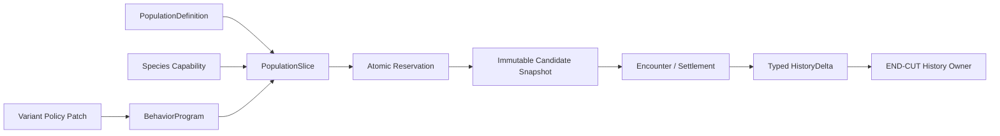

# FCF V1 Fish Entity / Variant Design Contract

本文件把 Species、PopulationDefinition、PopulationSlice、BehaviorProgram、Variant、Candidate 和
History 的边界集中定义。它是设计契约，不要求在 reference prototype 中
模拟 persistent individual fish。

## 0. 快速阅读

**概念**：Fish Entity 不是一个可任意改字段的巨型对象，而是 PopulationDefinition、
Species capability、Slice context、Program policy、Variant 和 Candidate snapshot 的分层。

**整体机制**：PopulationDefinition 管理 q/stock；Species 定义能力；Slice 绑定生命周期；
Program 定义当前策略；Variant 只做 allowlist policy patch；reservation 成功后才形成
不可变 Candidate snapshot，History 在 END-CUT 统一更新。

**配置方式**：在不同面板配置 population scale、capability、slice、policy 和 variant；
capability/identity/owner 字段只读，变更必须创建新 revision 并接受 review。

**中文机制描述**：把“是什么鱼、哪批鱼、现在采用什么策略、这次遭遇是哪份质量”
分开建模，避免 Variant 越权或旧 Candidate 被新配置追溯改写。



## 1. 六种不同语义的对象

| 对象 | 回答的问题 | 生命周期 | 是否可由 Variant 改写 |
|---|---|---|---|
| `SpeciesCapability` | 这类鱼物理上/感知上能做什么？ | artifact version | 否 |
| `PopulationDefinition` | 哪个可计量的 stock 与 `q`/cohort 轴被管理？ | artifact version | 否 |
| `PopulationSlice` | 当前哪一批 exchangeable mass、处于什么生命周期角色？ | slice transition | 否；只转移 PSU |
| `BehaviorProgram` | 这批鱼此刻采用什么策略？ | policy revision | 可被声明的 policy patch 选择 |
| `FishVariant` | 同一 Species 的受限策略变体是什么？ | compiled artifact | 只能覆盖 allowlist policy |
| `Candidate` | 哪个已保留的有限质量正在经历这次 encounter？ | reservation 至 settlement | 不可改写 capability/policy |

V1 默认不创建 persistent individual fish。`Candidate` 是一次成功 atomic
reservation 后产生的 encounter 实体，不能反向证明世界中存在一个持久个体。

```text
PopulationDefinition {
  population_id
  population_revision
  q
  cohort_axes[]
  history_scope = SLICE | COHORT
}
```

## 2. SpeciesCapability：稳定能力边界

最小字段：

```text
SpeciesCapability {
  species_id
  capability_revision
  population_definition_id
  anatomy_profile_id
  sensory_channels[]
  allowed_contact_types[]
  task_capability_ids[]
  thermal_capability_id
  oxygen_capability_id
  history_schema_id
}
```

`SpeciesCapability` 只引用一个外部 `population_definition_id`；Population
identity、cohort axes 与 `q` 的权威 owner 是 `PopulationDefinition`，不是
Species capability。两者必须通过 immutable reference 绑定，不能由 Variant
改写。

这些字段描述能力或尺度，不描述“今天想不想做”。`q` 与 population identity
属于 `PopulationDefinition` boundary；接触类型、感知通道、热/氧上下限和
task capability 属于 `SpeciesCapability` boundary。修改任一 boundary 都必须
生成对应的新 revision，并触发 recalibration 和 reviewer sign-off。

## 3. PopulationSlice：可转移的质量上下文

```text
population_slice_key = (population_id, cohort_key, lifecycle_role_key)

PopulationSlice {
  key
  capability_revision
  behavior_program_id
  entered_at
  minimum_hold_s
  hysteresis_policy_id
}
```

Slice 不拥有鱼的另一份总量。LifecycleCommitment 只在一个 transaction 中把
PSU 从源 slice 转到目标 slice，并记录 `from_key`, `to_key`, `delta_psu`,
`transition_id`。同一 `transition_id` 重放必须返回原结果；不同 delta 冲突。

## 4. BehaviorProgram：当前策略

Program 可以声明：

- motive priority 和 predicate 选择顺序；
- occupancy node policy；
- motive-specific EntryOffer；
- task profile 的选择；
- semantic reevaluation trigger、debounce、hysteresis；
- 已声明 capability 内的 contact/task 选择。

Program 不得声明：

- 新的 ContactType、sensory channel、task capability 或生理边界；
- 新增/销毁 population mass 的隐式操作；
- 直接写入 A/E/Commit/Hook/Settlement 的 terminal coefficient；
- 将自身 ID 写入 `population_slice_key`。

## 5. Variant：受限、可审计的 policy patch

### 5.1 合并算法

Variant 编译时绑定一个 `species_id` 和一个基准 `program_id`。编译器执行：

```text
validate species match
validate every override path ∈ POLICY_ALLOWLIST
validate value type / enum / range
apply overrides in canonical path order
emit flattened artifact + diff + source revision
```

运行时不做动态多层 mixin，也不接受未编译的 Variant。相同 path 的多个 patch
必须显式给出 priority；同优先级冲突直接拒绝。Variant 不能覆盖：

```text
population_definition.q
population_definition.population_id
species.anatomy_profile_id
species.sensory_channels
species.allowed_contact_types
species.*_capability_id
settlement_owners
population_slice_key
```

允许覆盖的例子：

```text
program.motive_priority
program.occupancy[*].grade
program.entry_offers[*].base
program.task_profile_id
program.trigger_policies[*]
```

### 5.2 版本和 Candidate 快照

Variant 或 Program revision 只影响之后 materialize 的 Candidate。Candidate
必须保存：

```text
species_id + capability_revision
population_slice_key
program_id + program_revision
variant_id + variant_revision (or NONE)
world_snapshot_revision
history_schema_revision
semantic_snapshot_fingerprint
```

之后的编辑不能改变既有 Candidate 的 encounter 语义；它只在下一次合法
Opportunity 或 lifecycle cut 生效。

## 6. Candidate 与 History 的边界

Candidate 只持有本次 encounter 所需的不可变输入和 reservation 引用：

```text
Candidate {
  candidate_id
  reservation_id
  proposal_id
  capability/program/slice snapshot
  presentation snapshot
  encounter_state
  commit_result
  terminal_settlement_id
}
```

Candidate 不直接写 satiation、wary memory、thermal acclimation 或 population
mass。Encounter 结束后只产生 typed `HistoryDelta`；History/Future 是唯一应用
和持久化 owner，且以 `transaction_id` 幂等。若需要拆分多个字段，`delta_id`
只能是绑定到该 `transaction_id` 的稳定子键，不能成为第二个 terminal identity。
普通鱼的 History 是 slice/cohort 级；
若未来引入个体记忆，必须作为 V1.1 新 identity/storage contract。

## 7. 编辑器工作流

编辑器按能力→策略→变体三层显示，并在每次修改时显示：

```text
field path → owner → old/new value → affected revision
           → affected semantic fingerprint → recalibration requirement
```

保存操作必须是：

1. 对 draft 做 schema + semantic validation；
2. 生成完整 flattened artifact、机器 diff 和 author metadata；
3. 为 capability/scale/owner 变化标记 `REVIEW_REQUIRED`；
4. 只有通过 reviewer 的 immutable version 才能 compile 给 runtime。

编辑器不得自动把越权字段“降级成 warning”，也不得把缺失 capability、
World Fact 或 owner 补成默认值。

## 8. 必须保持的反例

1. **Variant 越权**：cold variant 不能把 preferred/thermal capability 扩到
   Species 未声明的范围。
2. **旧 Candidate 漂移**：Program 编辑不能改变已 materialize Candidate 的
   motive、task profile 或 contact repertoire。
3. **质量重复计算**：Slice transition 只能转移 PSU，不能另行创建相同质量。
4. **History 双写**：Contact/Hook 不能直接写 History；只能提交 typed delta。
5. **patch 冲突**：同一 override path 的不确定合并不得依赖输入顺序。

## 9. V1 结论

```text
Species capability (stable)
  + Slice context (mass/lifecycle)
  + Program policy (current behavior)
  + optional Variant (allowlisted policy patch)
  → immutable Candidate snapshot after reservation
  → typed HistoryDelta at END-CUT
```

这套分层使工程师可以分别实现 schema/compiler、resolver、snapshot 和
History adapter，而不需要把“鱼”实现成一个可任意修改的巨型对象。
