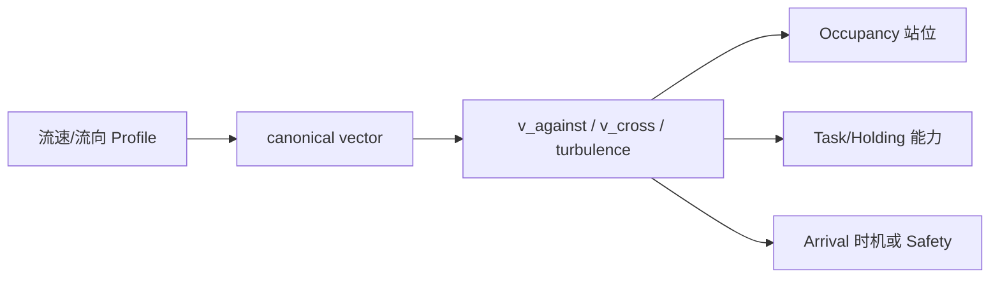

# FCF V1 流速/流向机制设计（Design-only）

> 作者成本旁证：局部窄流带与桥墩、开放水面等既有区域相交时的静态切分压力，
> 见 [Ogre Lake companion experiment](ogre_lake_manual_region_companion_experiment.md)。
> 该实验不改变本机制的 owner、arrival 或 safety 契约。

流速不是一个“鱼更活跃/更难咬”的总系数。它描述水动力边界条件，必须
先区分鱼的定位选择、姿态维持、逆流游动成本和 presentation 到达时机。

## 0. 快速阅读

**概念**：流是带坐标系、方向、速度、湍流和 uncertainty 的水动力向量事实。

**整体机制**：先把流向转换为 canonical frame 下的顺流/逆流/横流分量；再由
唯一 owner 分别结算站位、holding/task budget、arrival timing 或安全后果。

**配置方式**：World Fact 配置 flow profile、frame、深度和数据质量；Species
配置游动/站位 capability；Program 选择 holding/task/arrival policy，不直接写 E。

**中文机制描述**：流速不是“活跃度”，而是鱼能否站稳、逆流移动和 presentation
何时到达的物理条件；这些后果分别处理，不能组成一个隐藏总惩罚。



## 1. World Fact：水动力事实

```text
FlowFact {
  velocity_vector_mps
  turbulence_rms
  canonical_frame_id
  direction_uncertainty_deg
  measured_at
  location_id / depth_m / profile_id
  source_kind = SENSOR | HYDRO_MODEL | MANUAL_CALIBRATION
  quality = DIRECT | INTERPOLATED | STALE | MISSING
  uncertainty_mps
  source_revision
}
```

流向必须是向量，不得只存一个无符号 speed。节点局部坐标系、鱼的可用
方向和 presentation 的运动轨迹必须在同一 snapshot 中确定。流速数据与
温度/DO 的校准输入可以相关，但下游只接收 canonical `FlowFact`，不允许
resolver 自己从 DO 或温度推算流速。

## 2. 鱼属性边界

### Species capability

```text
FlowCapability {
  preferred_current_min_mps
  preferred_current_max_mps
  station_holding_max_mps
  burst_against_current_max_mps
  rheotaxis_profile_id
  turbulence_tolerance_profile_id
}
```

这些属性表达鱼“能否维持姿态/逆流移动”的物理能力。Variant 不得扩展
能力上限；体型、生命阶段差异应由独立 profile 表达。

### Program / Slice policy

```text
FlowPolicy {
  occupancy_mode
  avoidance_threshold_mps
  holding_strategy
  arrival_mode
  hysteresis_mps
  minimum_hold_s
  task_profile_id
}
```

Program 只决定当前 Slice 如何使用能力（例如选择回水区或正面流），不
把 policy 写成 Species 的新能力。

### History

```text
FlowHistory {
  recent_exposure_integral
  fatigue_debt
  last_reorientation_at
}
```

在 END-CUT 更新；Candidate snapshot 后不被后续流速读数隐式改写。

## 3. 明确的三个物理后果

### 3.1 Occupancy：长期站位适宜性

```text
v_against = max(0, dot(velocity_vector, local_upstream_axis))
v_cross   = magnitude(velocity_vector - projected_parallel_component)
w_flow_occupancy = holding_profile(v_against, v_cross,
                                    avoidance_threshold, preferred_range)
```

`local_upstream_axis` 来自 `canonical_frame_id` 与 Slice 的 rheotaxis
profile；顺流/逆流不能仅由 speed magnitude 判定。若某 Species 明确声明
magnitude-only holding profile，必须在 profile 中写出“方向不影响该后果”
的适用前提。方向基准或 uncertainty 改变会生成新的 semantic fingerprint。

`holding_profile` 在一次纯函数调用中同时解释逆流与横流分量，必须声明
横流边界和单位，并直接输出一个 `[0,1]` 权重；实现不得再对 `v_cross`
另乘隐藏 penalty。它只进入 Occupancy allocator，表示节点长期可站位质量。
它不创建鱼、不
触发迁移 transaction，也不直接进入 Entry/E。`station_holding_max` 是能力
边界；长期分布的 avoidance threshold 必须是独立 policy 参数，避免把
“不能站住”与“当前运行时安全阻断”混成同一个 owner。

### 3.2 Conversion：当前动作成本

```text
task_budget = task_budget_profile(
  velocity_vector, turbulence, task_id, fatigue_history
)
```

单一 `task_budget_profile` 一次性消费温度、DO、flow、depth 等 canonical
事实（flow 的局部投影也在此 profile 内完成），输出带单位的 burst budget、
pursuit duration、orientation cost 或 recovery debt。禁止同时用
`speed_penalty × turbulence_penalty × DO_penalty` 表示同一个 exertion 后果。

### 3.3 Arrival/T：presentation 到达时机

只有当水流确实改变 presentation 的物理到达时间，才由 Arrival/T owner
处理：

```text
arrival_time = advection_model(path, velocity_vector, cast_motion)
```

它只改变到达时机或 ARRIVAL opportunity；不能再以同一流速后果降低
Occupancy 或 Entry。若 presentation 已由外部运动系统给出确定 arrival
time，则 FCF 不再重新计算流速 bonus。

## 4. 安全边界与不确定性

相对于 capability 的站位/逆流边界，区间完全安全为 `DEFINITE_SAFE`，
完全超出为 `DEFINITE_OUT`，相交为 `FLOW_RISK`，无可接受事实为 `UNKNOWN`。

- `FLOW_RISK`：禁止新的 Entry、Reservation 和 lifecycle enter；不追溯销毁
  已有 Candidate；trace 记录区间、profile、quality、revision 和 safety owner。
- `UNKNOWN`：V1 默认不向该 node 新增质量、不生成新 Candidate，保持已有
  Slice，并在 trace 写入 `UNKNOWN_DATA_BLOCK`。
- flow safety owner 只负责运行时阻断/声明迁移，不与 Occupancy 的长期
  预分配重复结算。

## 5. 与温度、DO、深度的组合

| 组合 | 可接受语义 | 禁止 |
|---|---|---|
| 流速 + DO | 流速造成水动力阻力，DO 造成呼吸/恢复压力；必须是两个可区分 task consequence | 两者都叫“耐力下降”并双重相乘 |
| 流速 + 深度 | 深度用于取局部 flow profile；不是额外 penalty | 深度先扣 A、流速再扣 E |
| 流速 + 温度 | 温度影响代谢 profile，流速影响外部阻力；各自 consequence_id | 用温度和流速重复表达同一 budget |
| 流速 + Arrival | advection 只在真实改变到达时间时拥有 T | 同一到达延迟再扣 occupancy/Entry |

如果无法证明后果不同，V1 默认合并为一个声明清楚的 profile。

## 6. Resolver 顺序

```text
FlowFact snapshot
→ coordinate/path normalization
→ local holding interpretation (Occupancy)
→ task-budget interpretation (Conversion, if Candidate exists)
→ arrival-time interpretation (Arrival/T, only if externally unresolved)
→ safety classification
→ safety gate (before any new Entry/Reservation/lifecycle-enter write)
```

Safety classification 可以提前计算，但 safety gate 必须先于任何新 Entry、
Reservation 或 lifecycle-enter 的写入；被阻断时不得产生新的 ledger event。
它不追溯修改已经 snapshot 的 Candidate。每个输出都带 `consequence_id`、
owner、输入 revision 和 stage。

## 7. 编辑器

编辑器拆成：

1. Flow Fact source：向量、湍流、坐标系、深度、quality、uncertainty、revision；
2. Species capability：站位/逆流/湍流 profile；
3. Slice policy：holding、rheotaxis、hysteresis、minimum hold；
4. Arrival model：path、advection model、是否由外部运动系统提供 arrival time；
5. Task profile：输出单位、边界、fatigue 输入、唯一 consequence_id；
6. Owner graph：`fact → consequence → owner → stage`。

保存时区分 `WORLD_SOURCE_CHANGE`、`CAPABILITY_CHANGE`、`POLICY_CHANGE` 和
`ARRIVAL_MODEL_CHANGE`；能力或尺度改变需要 recalibration/reviewer sign-off。

## 8. 反例

1. 只用 flow speed、不用 vector，导致顺流/逆流被错误视为相同；除非
   profile 明确声明 magnitude-only 适用前提，否则禁止。
2. Occupancy 已降低站位质量，又在 Entry 以“流大”扣一次；禁止。
3. task profile 已扣逆流 burst budget，又用 DO/温度对同一 budget 双扣；禁止。
4. 外部系统已有 arrival time，FCF 再用 flow 重掷 ARRIVAL；禁止。
5. 流速 uncertainty 每帧触发一个新 opportunity；禁止，必须 causal-cut + stable ID。
6. Variant 把 `burst_against_current_max` 改到 Species capability 之外；禁止。

## 9. 最小闭合结论

```text
Flow vector snapshot
→ holding OR task cost OR arrival timing OR safety
→ distinct consequence_id
→ one owner
→ deterministic downstream effect
```

流速机制在 owner 图、向量坐标、arrival 归属和 uncertainty 策略闭合前，
不应实现成一个通用 `current_multiplier`。
