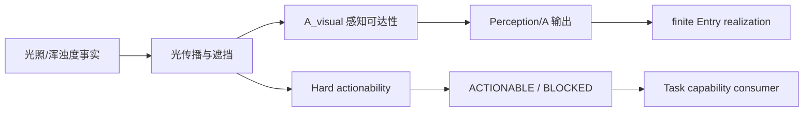

# FCF V1 光照与浑浊度机制设计（Design-only）

光照和浑浊度首先改变的是光传播与可观测性，不是鱼的数量，也不是自动
改变鱼的 motive。V1 先把“能否看见/分辨”与“鱼是否在场”严格分开。

## 0. 快速阅读

**概念**：光照与浑浊度共同描述光传播条件，不是鱼数量或咬口意愿。

**整体机制**：OpticalFact 经传播/遮挡模型生成 `A_visual`；独立的 Hard
actionability gate 只在视觉 task 真正不可执行时返回 `BLOCKED`，不改写 A/E。

**配置方式**：World Fact 配置 lux、NTU、光谱、衰减 profile、深度与 revision；
Species 配置 sensory capability；Program 只能选择已声明的感知/task policy。

**中文机制描述**：先算“信号能不能传到鱼那里”，再算“鱼有没有对应感官、
任务是否可执行”；看不清不等于鱼不在场，也不自动改变动机。

**作者成本 companion evidence**：Morning / Afternoon 阴影边界移动时，静态
手工 Region 为何需要预拆稳定子区，见
[Ogre Lake reproducible overlay experiment](ogre_lake_reproducible_overlay_experiment.md)。该实验
不改变 `A_visual`、Occupancy 或 TaskCapability 的语义边界。



## 1. World Fact

```text
OpticalFact {
  illumination_lux
  turbidity_ntu
  spectral_band
  attenuation_profile
  measured_at / location_id / depth_m
  source_kind / quality / uncertainty
  source_revision
}
```

`illumination_lux` 与 `turbidity_ntu` 是物理事实。presentation 的 silhouette、
flash、vibration 等由 `ActualPresentation` 编译，不由鱼 resolver 根据 raw
item ID 猜测。每个 causal cut 固定 optical snapshot 与 revision。

## 2. 三种不同后果

### 2.1 Perception owner：可见性与显著性

```text
A_visual = perception_profile(
  optical_fact, presentation_truth, fish_sensory_capability
)
```

`A_visual` 是该鱼对该 presentation 的空间/感官 access，不是 detect success，
也不是 Entry/E。profile 必须说明是 visibility、contrast、motion salience
还是 range 哪一种 consequence；同一物理后果不得在多个 perception pass 再扣。

### 2.2 Occupancy owner：长期光环境偏好

某些 Species 会选择阴影、明亮或低浑浊节点。该解释只进入长期 Occupancy：

```text
w_light_occupancy = light_habitat_profile(optical_fact, slice_policy)
```

它不改变 `A_visual`，也不等价于“鱼没被看见”。如果同一光照变化既改变
长期站位又改变在场鱼的视觉 access，必须登记两个不同 consequence_id。

### 2.3 Safety owner：极端环境

V1 不把普通浑浊度当作安全问题。只有明确声明的极端阈值（例如传感器/环境
模型判定不可生存）才产生 `OPTICAL_SAFETY_RISK`，并沿 Safety gate 阻断新
Entry/Reservation；不追溯销毁 Candidate。普通“看不清”只能降低 A_visual。

## 3. 感知公式的边界

使用单一、可解释的 perception profile，而不是全局 multiplier：

```text
A_visual = profile(
  range_m,
  contrast_ratio,
  motion_salience,
  spectral_match,
  fish_sensory_channels
)
```

profile 输出 `[0,1]` 的 Accessibility，并声明输入单位、边界、缺失策略和
owner。浑浊度不能同时降低 range、contrast、salience 后再由另一个模块以
“low light penalty”重复扣同一可见性后果；若输入确实对应不同感官通道，
必须有不同 consequence_id 和可审计组合算子。

## 4. 与 Entry / Encounter 的关系

```text
OpticalFact + ActualPresentation
→ A_visual
→ hard actionability gate (only true impossibility)
→ motive / E
```

Hard actionability gate 的 semantic owner 是 `Perception/TaskCapability`。
它只读取 Species 已声明的感官/task capability 与 presentation truth，输出
确定性的 `ACTIONABLE` 或 `BLOCKED`；不修改 `A_visual`、不产生第二个
perception penalty，也不直接写入 `E`。输出必须带 `consequence_id`、owner、
stage、输入 revision 和 block reason。只有真正无法执行该 task 时才返回
`BLOCKED`。

低 `A_visual` 不自动等于 `E` 低；鱼可能看不见 presentation，但仍可能因
振动或水动力线索产生 motive。只有 Species capability 声明依赖视觉的
task，才可在 Conversion 使用该 task 的视觉输入。禁止把同一“看不清”在
Perception、Entry 和 Encounter 各扣一次。

如果视觉依赖 task 在 Conversion 使用视觉输入，必须证明它产生了与
`A_visual` 不同的 task consequence（例如瞄准误差或识别失败），并使用
独立的 `consequence_id`；否则只能消费已有的 `A_visual`，不能再次扣减。

## 5. 数据不确定性

- `DEFINITE_VALID`：事实区间足以计算 profile；
- `OPTICAL_RISK`：关键安全边界不确定，Safety 阻断新进入；
- `UNKNOWN`：V1 默认不新增 Occupancy 质量、不生成新 Candidate，并在 trace
  写入 `UNKNOWN_DATA_BLOCK`；已有 Candidate 使用 snapshot，不被追溯改写。

不确定性不能通过高频采样产生额外 perception/entry rolls。

## 6. 编辑器

编辑器必须分开：

1. Optical Fact source：lux、NTU、光谱、attenuation、深度、quality、revision；
2. Presentation compiler：silhouette、flash、motion、spectral truth；
3. Species sensory capability：visual/motion/vibration channel 与 range profile；
4. Perception profile：输入单位、边界、输出 `A_visual`、consequence_id；
5. Occupancy policy：长期光环境偏好；
6. Trace/owner graph：`fact → presentation relation → A_visual/occupancy → stage`。

Variant 只能改变已声明的 policy 或 presentation interpretation，不能新增
Species 感官通道或绕过 hard actionability。

## 7. 反例

1. 浑浊度降低视觉 access，却被解释为鱼离开节点；禁止，除非另有 occupancy
   consequence 且 owner 独立。
2. lux 与 turbidity 都降低同一个 contrast 后果；必须合并 profile，禁止双扣。
3. 视觉不可见时仍有 vibration cue；不得把 `A_visual=0` 写成 hard deny，除非
   该 task 明确要求视觉且确实不可执行。
4. 高帧率 optical sampling 反复触发 Entry；禁止，必须 stable opportunity。
5. Variant 把 Species 的视觉能力扩展到未声明通道；禁止。

## 8. 最小闭合结论

```text
Optical facts
→ presentation-specific perception profile
→ A_visual (not detect, not E)
→ optional independent occupancy consequence
→ deterministic downstream use
```

光照/浑浊度在 perception profile、感官 capability 和 occupancy owner 未闭合
前，不应实现成一个全局 `visibility_multiplier`。
