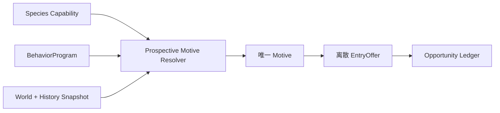

# FCF V1 Prospective Motive / BehaviorProgram 设计（Design-only）

Motive 是一次 opportunity 下对“鱼为何可能开始该 Encounter”的语义解释，
不是鱼的持久人格、不是 Candidate，也不是一个可随意叠加的 bonus。BehaviorProgram
是当前 Population Slice 的 policy；Species 只定义能力边界。

## 0. 快速阅读

**概念**：Motive 是一次 opportunity 下“为何开始接近”的确定性解释；
BehaviorProgram 是当前 slice 的策略，不是物种能力或持久人格。

**整体机制**：Program 按显式优先级检查 snapshot predicates，从
`FORAGE/DEFEND/INVESTIGATE/NONE` 中选一个 motive，再生成一个离散 EntryOffer；
相同输入必须得到相同结果，随机性不在 Motive 内发生。

**配置方式**：配置 motive priority、typed predicates、capability requirements、
EntryOffer base/modifier、trigger、debounce/hysteresis 和 revision；同优先级可重叠
规则编译失败。

**中文机制描述**：先决定“鱼为什么值得开始这次互动”，再决定“是否给出进入
机会”；它不会先随机抽一条鱼，也不会把多个动机分数相加。



## 1. 三类输入

```text
Species capability       能做什么
BehaviorProgram policy   当前 Slice 倾向怎样使用能力
Snapshot facts/state     当前 world fact + History revision
```

Resolver 不得读取未 snapshot 的实时数据，也不得向 Species capability 写入
当前情绪。Candidate 形成后，motive 与其输入 fingerprint 一并 snapshot。

## 2. Motive 输出

```text
ProspectiveMotive {
  motive = FORAGE | DEFEND | INVESTIGATE | NONE
  confidence_band = NONE | WEAK | NORMAL | STRONG
  cause_ids
  owner = motive_resolver
  input_revisions
}
```

`confidence_band` 是规则解释强度，不是额外概率；真正的 Entry 随机性只在
EntryOffer 的明确边界发生。`ESCAPE` 等未进入 RC4 `EntryMotive` 枚举的动机
属于 V1.1/deferred，不得出现在 V1 artifact 中。`NONE` 表示没有合法 motive，不产生 proposal，
但不改变 Population PSU。

## 3. BehaviorProgram 结构

```text
BehaviorProgram {
  program_id
  slice_role
  allowed_motives
  priority_rules[]
  entry_offers[motive]
  task_profiles
  reevaluation_triggers
}
```

每条 priority rule 必须声明：

```text
rule_id, priority, when_facts, when_history, required_capabilities,
output_motive, cause_id, effective_interval
```

相同 priority 的谓词重叠时编译失败；不能依赖配置文件顺序。rule 只能输出
已声明 motive，不能直接输出 E、Candidate、ContactType 或 Settlement。

## 4. 唯一 resolver 顺序

```text
read immutable world/history snapshot
→ filter rules by slice/program/capability
→ evaluate predicates deterministically
→ choose highest-priority matching rule
→ emit one ProspectiveMotive
→ evaluate one motive-specific EntryOffer
→ consume one Opportunity
```

禁止 alternate implementation：

```text
先随机抽鱼/抽 motive
→ 再检查 world fact 或 capability
```

也禁止把多个 motive 线性相加成“总动机分数”；若产品需要混合行为，必须
定义一个新的离散 motive 和其规则，否则结果不唯一。

## 5. World Fact 与 History 的使用

World fact 说明节点/事件当前发生了什么；History 说明该 Slice 到本 cut
为止发生过什么。二者可同时作为 predicate input，但必须保持 consequence
区分：

```text
resource_state → node-resource cause_id
satiation      → internal-state cause_id
```

如果两者表达同一个“鱼不开始觅食”后果，只能由一个 motive rule 解释，
不能在 Occupancy 和 EntryOffer 各扣一次。

## 6. Trigger 与 reevaluation

允许的 trigger 必须是语义事件，不是每帧布尔值：

```text
trigger_id
semantic_event_type
debounce_s / hysteresis
source_revision_basis
scope_id
```

同一 trigger 在同一 scope/revision 只能消费一次。若相同 `trigger_id` 在新的
`source_revision` 或 semantic fingerprint 下再次出现，不能仅按字符串去重：
必须拒绝为 identity conflict，或生成包含新 revision/fingerprint 的新
semantic trigger identity。输入频率、FPS、pause/unpause 或 cast reset 不得
创造额外 motive opportunity。若重新进入新 scope，
必须产生明确的 `NEW_SCOPE_AFTER_REENTRY` identity，而不是复用旧事件或隐式
重掷。

## 7. EntryOffer 的边界

```text
E = entry_offer(program, selected_motive, presentation_truth, snapshot)
```

EntryOffer 只能表达“该 motive 是否开始 Encounter”，输出现有 `EntryGrade`
（包括 `NONE` 作为 deny）；不得引入未声明的 `DENY` 类型。它不能改写 A、
Occupancy、Species capability、PSU 或 task budget。
同一 cause 在 Motive 与 EntryOffer 中若表达同一后果，必须合并；若是两个
可区分后果，分别登记 consequence_id。

## 8. 随机性边界

V1 随机性只允许出现在明确声明的 Entry/Commit/Contact 决策边界：

- Motive 规则选择：确定性；
- rule priority/overlap：编译期确定；
- EntryOffer grade：确定性输入；
- finite Entry realization：Binomial/Bernoulli 的明确 draw；
- Encounter conversion：固定 snapshot 下确定性；
- Commit：一次 deterministic seed-derived roll；
- Contact tie：声明 stable tie-break。

禁止为“更自然”在 Motive resolver 中加入未持久化随机数。

## 9. 编辑器

编辑器必须提供：

1. Capability panel：只读展示 Species 能力和 Program 可选范围；
2. Rule table/graph：priority、谓词、输入 fact/history、output motive、cause_id；
3. Overlap checker：相同 priority 重叠直接阻断保存；
4. Trigger panel：stable ID、debounce、hysteresis、scope/revision；
5. EntryOffer panel：motive → grade/deny 的离散规则；
6. Trace preview：输入 snapshot、命中规则、未命中原因、motive、E、Opportunity ID；
7. Version diff：区分 POLICY_CHANGE、HISTORY_INPUT_CHANGE、TRIGGER_CHANGE。

编辑器不得自动排序相同 priority、补全缺失 cause_id、把规则顺序当语义，
或允许 Variant 新增未声明 motive/capability。

## 10. 关键反例

1. 高帧率重复调用 resolver 产生多个 motive roll；禁止，Opportunity/trigger 去重。
2. 先按 abundance 随机抽鱼，再判断 motive；禁止，违反因果顺序。
3. `FORAGE + DEFEND` 相加成 1.4 的总分；禁止，必须选一个离散 motive。
4. resource scarcity 同时降低 Occupancy 和 E，却没有不同 consequence_id；禁止。
5. Program 选择 Species 未声明 task/contact；编译拒绝。
6. Candidate 已 snapshot 后，实时 history 改写其 motive；禁止。
7. rule priority 相同且 overlap，依赖 YAML 顺序；编译拒绝。

## 11. 最小闭合结论

```text
immutable snapshot
→ deterministic rule selection
→ one ProspectiveMotive
→ one motive-specific EntryOffer
→ one stable Opportunity consumption
```

Motive 机制在规则优先级、输入 revision、trigger identity、随机性边界和
consequence owner 未闭合前，不应实现成一个可调的 `motivation_score`。
