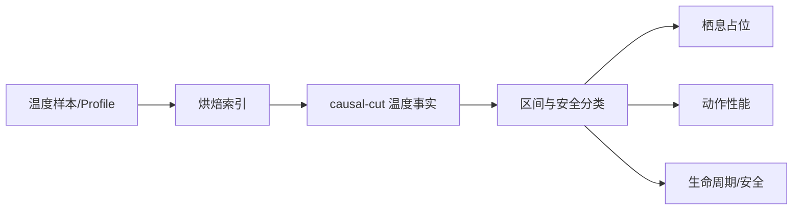

# FCF V1 温度机制设计（Design-only）

> 作者成本旁证：温度连续场被阈值化为静态手工 Region 后，与已有空间边界
> 错位所产生的切分与重编压力，见
> [Ogre Lake reproducible overlay experiment](ogre_lake_reproducible_overlay_experiment.md)。
> 该实验不改变本机制的 owner、snapshot 或计算契约。

本文件先定义语义和因果边界，不要求立刻改动运行时代码。温度不是一个
“给咬口率加减分”的总系数，而是一个环境事实，经过明确的鱼类解释后，
分别影响不同 owner 的机制。

## 0. 快速阅读

**概念**：温度是带位置、深度、时间、质量和 revision 的世界事实，不是咬口率。

**整体机制**：编辑/导入 `TemperatureProfile`，烘焙空间—深度索引；causal cut
固定 profile/index/插值算法 revision 后查询 `WaterTemperatureFact`，再由鱼类
capability/policy 分别解释为 Occupancy、Task Performance 或 Lifecycle 后果。

**配置方式**：World Fact 面板配置样本、层、热跃层、uncertainty 和 revision；
Species 面板配置 lethal/stress/preferred band；Program 面板配置 task profile、
hysteresis 和 transition threshold。Variant 不得修改 capability。

完整字段表、YAML 示例和烘焙/查询输出见
[temperature_profile_configuration.md](temperature_profile_configuration.md)，机器结构约束见
[`schemas/temperature_profile.schema.json`](../schemas/temperature_profile.schema.json)。

**中文机制描述**：先确定“这里此刻多少度”，再判断“这种鱼能否承受、是否适合
停留、能否完成动作”；三个结论分别结算，不能重复扣减。



## 1. 先固定问题边界

温度机制要回答四个不同问题：

1. 这里的水实际是多少度？（World Fact）
2. 这个温度对该 Species/Population Slice 是否适合长期停留？（Occupancy）
3. 已经进入该位置的鱼，在当前状态下能否完成某个动作？（Performance）
4. 温度变化是否满足生命周期或迁移转换条件？（Lifecycle）

以下问题不由温度直接回答：

- “这次 presentation 是否被感知”（Perception/A）；
- “鱼是否决定开始 Encounter”（Entry/E）；
- “是否必然咬钩”。

禁止把温度直接接到一个 universal bite multiplier，再让不同鱼和不同
presentation 各自重复解释。

## 2. 环境数据：先成为可审计的 World Fact

### 2.1 Canonical fact

运行时只向下游发布一个 causal-cut snapshot：

```text
WaterTemperatureFact {
  value_celsius
  measured_at
  valid_from / valid_to
  location_id
  depth_m (or profile_id)
  source_kind = SENSOR | HYDRO_MODEL | MANUAL_CALIBRATION
  quality = DIRECT | INTERPOLATED | STALE | MISSING
  uncertainty_celsius
  source_revision
}
```

`value_celsius` 是物理事实，不带 species、motive、bait 或“好钓/难钓”
解释。每个 causal cut 固定一次 snapshot；同一 cut 内的所有 resolver 读取
同一版本，不允许一个模块读 16.2°C、另一个模块读 16.4°C。

### 2.2 数据获取与质量策略

数据管道顺序必须是：

```text
sensor/model ingest
→ unit/time/location validation
→ outlier and gap classification
→ depth/time interpolation (if allowed)
→ uncertainty + quality annotation
→ immutable causal-cut snapshot
```

规则：

- 传感器原始值保留；校准产生新 revision，不覆盖历史值；
- 深度剖面只能在明确的空间/时间邻域内插值，不能跨越未观测的热跃层；
- `STALE` 或 `MISSING` 不得静默变成“鱼的默认温度”；
- 缺失时 resolver 必须返回 `UNKNOWN` 或使用明确声明的保守策略，且 trace
  记录原因；
- uncertainty 影响“是否能判定阈值”，不能被偷偷当作鱼的额外惩罚；
- snapshot 的 `source_revision` 必须进入 Opportunity semantic fingerprint，
  否则同一物理事件换数据后会发生不可解释 replay。

### 2.3 空间代表性

温度不是全水体一个标量。V1 至少需要：

```text
temperature(location, depth, causal_cut)
```

若当前地图只有单层数据，必须显式声明 `profile_mode=SINGLE_LAYER`；这
是数据能力限制，不应伪装成鱼类行为结论。Presentation 所在节点与鱼的
可达深度共同决定采样位置，不能由 Species resolver 自己改写位置。

### 2.4 编辑什么：TemperatureProfile，而不是查询结果

设计师/数据作者编辑的是一个中性的、版本化的 `TemperatureProfile`：

```text
TemperatureProfile {
  profile_id
  waterbody_id
  spatial_frame_id
  depth_layers[] = {
    layer_id, depth_min_m, depth_max_m,
    samples[] = {observed_at, location_cell, value_c, uncertainty_c,
                 source_kind, quality}
  }
  temporal_clock
  thermocline_boundaries[]
  profile_revision
}
```

编辑器允许的动作是：导入传感器/模型样本、修正单位和坐标、声明校准 revision、
标记数据质量、编辑已观测的层边界。它不允许在这个面板里选择 Species、motive、
饵或“适合度”。Species 的 `ThermalCapability` 在另一个 capability 面板编辑。

最小编辑流程：

```text
raw samples
→ unit/time/location validation
→ calibration as new revision
→ layer/thermocline annotation
→ profile validation
→ immutable TemperatureProfile revision
```

原始样本永不被覆盖；手工修改只生成新 revision，并保留 `source_sample_ids`。

### 2.5 怎么烘焙：离线索引，不烘焙鱼类结论

Profile 编译/烘焙阶段只预计算查询结构，不预计算“这条鱼会不会咬”：

1. 将空间样本放入 `spatial_frame_id` 对应的 cell/index；
2. 在每个 depth layer 内建立时间排序和可插值区间；
3. 把 thermocline 或未观测断层标为不可跨越边界；
4. 对每个区间计算可用性 metadata（freshness、最大 uncertainty、source revision）；
5. 输出不可变 `BakedTemperatureIndex(profile_revision, index_revision,
   interpolation_algorithm_revision)`。

烘焙器必须拒绝：单位不一致、深度倒置、空间坐标越界、跨越未观测热跃层的
插值、以及没有时间域的样本。烘焙结果只回答“哪些样本/区间可被查询”，不回答
“哪种鱼喜欢这里”。

### 2.6 怎么得出：causal-cut 查询算法

运行时解析器接收 `(location_id, reachable_depth_m, causal_cut)`，而不是接收
Species 解释：

```text
resolve_temperature(location, depth, cut):
  profile = pin_profile_revision(cut.profile_revision)
  index = pin_index_revision(cut.index_revision,
                              cut.interpolation_algorithm_revision)
  segment = locate_same_layer_and_time_segment(profile, location, depth, cut.time)
  if segment is missing or crosses thermocline:
      return UNKNOWN(reason, profile_revision)
  sample = exact_sample_or_declared_local_interpolation(segment)
  return WaterTemperatureFact(
      value_celsius=sample.value,
      uncertainty_celsius=sample.uncertainty,
      location_id=location,
      depth_m=depth,
      source_kind=sample.source_kind,
      quality=sample.quality,
      source_revision=(profile_revision, index_revision,
                       interpolation_algorithm_revision),
      valid_from/to=segment.validity)
```

`causal_cut` 必须固定 `(profile_revision, index_revision,
interpolation_algorithm_revision, cut_time)`；同一 cut 内所有 owner 读取同一个
Fact。上述 revision tuple 必须进入 `WaterTemperatureFact` 和 Opportunity
semantic fingerprint。查询不会根据鱼的 preferred band 改变 location/depth，也
不会把缺失值替换成全局默认温度。

### 2.7 从事实到鱼类结论

只有拿到上面的 Fact 后，Species/Program resolver 才执行解释：

```text
Fact → uncertainty interval [T-u, T+u]
     → DEFINITE_IN / AMBIGUOUS / LETHAL_RISK / DEFINITE_OUT
     → thermal_band / task_profile / lifecycle threshold
     → one owned consequence
```

因此“编辑温度”与“得出鱼类行为”之间至少隔着两个版本边界：
`profile_revision`（世界数据）和 `capability/policy revision`（鱼类解释）。
任一 revision 改变都会进入 semantic fingerprint，但不会改写已经 materialize
的 Candidate。

## 3. 鱼的温度属性：能力、偏好、状态分开编辑

### 3.1 Species capability（稳定、不可由 variant 改写）

```text
ThermalCapability {
  lethal_min_c
  lethal_max_c
  stress_min_c
  stress_max_c
  preferred_min_c
  preferred_max_c
  acclimation_model_id
  thermal_sensitivity_profile_id
}
```

这些值描述“能否生存/承受什么”，不是“今天是否会追饵”。`lethal` 必须
覆盖 `stress`，`stress` 必须覆盖或邻接 `preferred`；区间倒置、空区间或
跨越不可能物理范围都应在 DSL 编译时拒绝。

### 3.2 Slice policy（可由 BehaviorProgram 选择）

```text
ThermalPolicy {
  occupancy_weight_mode
  transition_thresholds
  minimum_hold_s
  hysteresis_c
  task_profile_id
}
```

它描述当前 Population Slice 如何使用 Species 已有能力。例如同一 Species
的 SPAWN_GUARD 与 OPEN_WATER Slice 可以有不同迁移阈值；它不能扩大物种的
生理边界。

### 3.3 History / acclimation（END-CUT 才能更新）

历史状态可包含：

```text
ThermalHistory {
  acclimated_center_c
  exposure_duration_s
  recent_delta_c
  last_transition_at
}
```

它不是每帧直接改写的属性。输入在 causal cut 结束时累积，下一 cut 才可
影响解释；Candidate 必须 snapshot 自己的 thermal interpretation。

## 4. 温度解释的唯一公式

先用一个可审计的分段函数，不在 V1 引入无法校准的系数堆：

```text
thermal_band(T; Ls, Pmin, Pmax, Us) =
  0                         T ≤ Ls or T ≥ Us
  ramp(Ls → Pmin)           Ls < T < Pmin
  1                         Pmin ≤ T ≤ Pmax
  ramp(Pmax → Us)           Pmax < T < Us
```

其中 `Ls/Us` 是 stress boundary，preferred band 为 `[Pmin,Pmax]`，`ramp`
是线性函数。致死边界只用于 hard viability；不能把“不舒服”误写成鱼
不存在。

V1 的三个输出必须分开：

### 4.1 Occupancy owner：长期停留/分布

```text
w_occupancy = thermal_band(T_local, ...)
```

它只进入 Occupancy/Population 的节点权重，再由 occupancy allocator 做
归一化和 cap+redistribute。它不直接进入 `E`，也不扣一次“咬口率”。

### 4.2 Conversion owner：已在场鱼的动作能力

对需要持续运动或爆发的 task，使用独立的 performance profile：

```text
p_task = task_profile(T_local, acclimated_center, task_id)
```

`p_task` 只影响 Encounter Conversion 的任务输出（例如 pursuit duration、
burst budget、turn success），不重新改变 Occupancy，也不重新判定 Perception。
同一物理后果必须只在一个 task owner 结算。

### 4.3 Lifecycle owner：状态转换

```text
transition_signal = threshold_crossing(
  T_local, thermal_history, threshold, hysteresis
)
```

它只产生 lifecycle transition intent；transition 由 LifecycleCommitment
决定是否满足 minimum hold 和 hysteresis。不能因为 transition signal 被
触发，就再额外扣一次 occupancy 或 entry probability。

## 5. A/T/E 的关系

V1 默认如下：

```text
Temperature fact
  → Occupancy weight                 (long-term presence)
  → optional task performance        (already-present fish)
  → lifecycle transition signal      (state change)
```

温度不直接成为 `A`、`T` 或 `E` 的隐含 bonus。只有当温度事实改变了一个
明确的 arrival timing 物理事实，才由 ARRIVAL/T owner 处理；否则温度造成的
“这里鱼少”已经由 Occupancy owner 结算，不能再在 E 重罚。

## 6. 不确定性与判断逻辑

阈值判断必须区分：

- `DEFINITE_IN / DEFINITE_OUT`：相对于 lethal boundary，测量区间完全在
  安全侧（IN）或致死侧（OUT）；
- `AMBIGUOUS`：uncertainty 与阈值相交；
- `UNKNOWN`：没有可接受 snapshot。

`AMBIGUOUS` 不得偷偷随机化。V1 采用 deterministic conservative policy：
一般边界不确定时保持当前 slice，记录 `needs_recheck=true`，等下一 causal
cut 的新事实；但若 uncertainty 区间与 lethal 区域相交，使用更严格的
`LETHAL_RISK` 安全分类：

- 禁止该位置产生新的 Entry、Reservation 或 lifecycle 进入；
- 不追溯性地销毁已经存在的 Candidate，也不把测量误差直接结算为死亡；
- 由 Lifecycle/ safety owner 发出 `needs_recheck=true`，并在 trace 中记录
  温度区间、lethal boundary、数据 quality 和阻断原因；
- 下一 causal cut 若变为 `DEFINITE_IN`，恢复正常流程；若变为
  `DEFINITE_OUT`，才允许执行已声明的迁移/恢复策略。

这样既不会让新鱼进入可能致死的环境，也不会把 uncertainty 偷换成一个
随机死亡 roll。若产品将来需要“确认致死后移除”的规则，必须作为单独的
Lifecycle/Settlement contract 设计，而不是隐含在温度 resolver 中。

## 7. 编辑器设计

温度编辑分为三个面板，避免把事实和解释混在一起：

1. **World Fact source panel**：sensor/model source、空间/深度、校准 revision、
   freshness、uncertainty；不可编辑 species 解释。
2. **Species thermal capability panel**：lethal/stress/preferred bands、
   acclimation profile、task profiles；显示单位、数据来源和适用 cohort。
3. **Program/lifecycle policy panel**：occupancy mode、transition threshold、
   hysteresis、minimum hold；只能选择已声明 capability 和 owner。

编辑器必须：

- 实时检查区间包含关系和单位；
- 将 `w_occupancy`、`p_task`、`transition_signal` 展开为 trace；
- 显示每个温度因子的 sole owner；
- 禁止 Variant 修改 lethal/stress/preferred capability 或 `q`；
- 将改动标为 `CAPABILITY_CHANGE`、`POLICY_CHANGE` 或 `WORLD_SOURCE_CHANGE`；
- 对 capability/scale change 要求重新校准和 reviewer sign-off；
- 对缺失、过期、插值数据显示警告，不能自动填“合理温度”。

## 8. 关键反例（必须先推理通过）

1. **双重扣减**：温度使 occupancy 降低后，Entry/E 又因“冷”降低一次；
   禁止，除非两者对应可证明不同的物理后果。
2. **空间平均掩盖热跃层**：表层 18°C 被错误用于 8m 深度鱼；禁止，必须
   使用深度 profile 或明确标记数据不可判定。
3. **高频采样增益**：同一温度 snapshot 每帧触发迁移/Entry；禁止，必须
   由 causal-cut 与 stable opportunity identity 去重。
4. **不确定性变随机奖励**：测量误差被当成额外 roll；禁止，先输出
   `AMBIGUOUS` 并等待新事实。
5. **Variant 越权**：cold variant 把 preferred band 改成 Species 未声明的
   能力；禁止，只能改变 policy 或已声明的 interpretation 参数。
6. **生命周期重复结算**：temperature crossing 同时减少 occupancy、触发
   ARRIVAL、再降低 E；必须指定唯一 transition owner 和后续因果链。

## 9. 设计结论

V1 温度机制的最小闭合定义是：

```text
World temperature snapshot
→ deterministic thermal classification
→ (occupancy OR task performance OR lifecycle signal), each with one owner
→ traceable downstream effect
```

在没有确认数据质量、空间剖面、acclimation 语义和 owner 矩阵之前，不应
把温度写成一个统一 multiplier，也不应先实现再用结果反推设计。

## 10. 可推理的判断表（V1）

温度判断先把测量值转换为一个有界区间：

```text
T_interval = [value_celsius - uncertainty_celsius,
              value_celsius + uncertainty_celsius]
```

然后对 lethal 边界执行严格的区间关系判断；不允许用一个“最接近的温度”
替代区间：

| 分类 | 判定 | Occupancy | Entry / Reservation | Lifecycle | Trace |
|---|---|---|---|---|---|
| `UNKNOWN` | 没有可接受 snapshot，或空间/深度映射失败 | 不新增质量；保持既有状态 | 不产生新的 Candidate | 不产生 transition | source/quality/failure reason |
| `DEFINITE_IN` | 整个区间位于 lethal 安全侧 | 按 policy 计算 | 允许走正常契约 | 允许检查非致死阈值 | snapshot revision + interval |
| `AMBIGUOUS` | 区间与 stress/preferred 边界相交，但不触及 lethal 区域 | 保持当前 slice；不重算历史质量 | 不因温度单独新增/减少机会 | `needs_recheck=true`，不切换状态 | boundary + interval + reason |
| `LETHAL_RISK` | 区间与 lethal 区域相交 | 不新增质量 | 阻断新的 Entry/Reservation | 仅 safety owner 可发出 recheck | lethal boundary + block reason |
| `DEFINITE_OUT` | 整个区间位于 lethal 致死侧/致死区域内（低于 `lethal_min` 或高于 `lethal_max`） | 由已声明的迁移/恢复策略处理 | 不产生新的 Candidate | 可执行已声明的安全处置 | policy revision + reason |

这里的 `DEFINITE_IN` 仅表示“对 lethal 边界可判定安全”，不表示 preferred
或 stress 结论确定；后者仍由 `thermal_band` 和 policy 产生。`AMBIGUOUS`
也不是一次随机 roll，而是一个可重放的等待状态。若同一 causal cut 内重复
读取同一 `source_revision`，不得重复触发 transition、Entry 或 History 写入。

### 10.1 编辑器必须暴露的因果链

编辑器展示温度规则时，应按以下顺序展开，而不是只显示最终权重：

```text
WorldFact(value, interval, location, depth, quality, revision)
  → Classification(status, boundary, reason)
  → Interpretation(owner, profile_id, output)
  → Downstream effect(consequence_id, stage)
```

每个可编辑字段都必须能回答三个问题：

1. 它是世界事实、Species capability，还是 BehaviorProgram policy？
2. 它改变哪一个输出（occupancy、task performance、lifecycle）？
3. 它改变后，哪个 semantic fingerprint / revision 会失效？

因此，编辑器可以让设计师调整 `preferred band`、`task_profile_id` 或
`hysteresis`，但不能让 Variant 直接改写 `lethal_*`；也不能把
`source_revision`、`uncertainty` 或 `quality` 当成可调的游戏参数。

### 10.2 一个最小纸面例子

若 `value=18°C, uncertainty=0.5°C`，lethal 安全边界为 `[4, 30]`，则
`[17.5,18.5]` 属于 `DEFINITE_IN`；occupancy 是否接近 1，要继续看该
Species 的 preferred/stress band，不能从 `DEFINITE_IN` 直接推出“高活性”。

若同一鱼的 `stress_max=20°C`，且测量区间为 `[19.8,20.4]`，则是
`AMBIGUOUS`：保持当前 slice，标记 recheck，不额外扣 E。

若 lethal 上界为 `20°C`，区间仍为 `[19.8,20.4]`，则升级为
`LETHAL_RISK`：阻断新的 Entry/Reservation，但不追溯销毁既有 Candidate。
